# Knowledge Notes

- [Git](#git)
    - [Git Initial](#git-initial)
    - [Git Clone](#git-clone)
- [Java](#java)
    - [Basics](#java-basics)
        - [Method Definition](#method-definition)
        - [AbstractClass vs Interface](#abstract-class-vs-interface)
        - [Nested Classes](#java-nested-classes)
        - [Class Object](#class-object)
        - [Data Types](#data-types)
        - [String pool](#string-pool)
        - [Generics](#java-generics)
    - [Collections](#java-collections)
        - [Interface Collection](#java-interface-collection)
            - Interface List
                - LinkedList
                - ArrayList
            - Interface Set
                - HashSet
                - LinkedHashSet
                - TreeSet
        - [Interface Map](#java-interface-map)
            - [HashMap](#java-hashmap)
            - [HashTable](#java-hashtable)
            - LinkedHashMap
            - WeakHashMap
            - TreeMap
    - [Concurrency](#concurrency)
        - [Thread](#java-thread)
        - [Lock vs Monitor](#lock-vs-monitor)
        - [Synchronized vs Volatile vs Atomic](#synchronized-vs-volatile-vs-atomic)
        - [Executors](#executors)
        - Synchronizers
        - [Concurrent Collections](#java-concurrent-collections)
            - [ConcurrentHashMap](#java-concurrenthashmap)
            - [SynchronizedHashMap](#java-synchronizedhashmap)
    - [JVM](#jvm)
        - [JVM Architecture](#jvm-architecture)
        - [JVM Memory Model](#jvm-memory-model)
            - [Stack vs Heap](#stack-vs-heap)
        - [Garbage Collector](#garbage-collector)
        - [Java Reference Types](#java-reference-types)
- [Kotlin](#kotlin)
    - [Kotlin Basics](#kotlin-basics)
        - [Nested Classes](#kotlin-nested-classes)
        - [Class Any](#class-any)
        - [Data Classes](#data-classes)
        - [Sealed Classes](#sealed-classes)
    - [Kotlin Syntax Features](#kotlin-syntax-features)
        - [Scope functions](#kotlin-scope-functions)
        - [Properties](#kotlin-properties)
        - [Delegated Properties](#kotlin-delegated-properties)
        - [Extensions](#kotlin-extensions)
    - [Kotlin Generics](#kotlin-generics)
- [Android](#android)
    - [App Components](#app-components)
        - [Activity](#activity)
        - [Service](#service)
        - [Broadcast Receiver](#broadcast-receiver)
    - [Fragments](#fragments)
    - [Multithreading](#multithreading)
    - [Views (widgets)](#views-widgets)
        - [View Class](#view-class)
    - [Context](#context)
    - [ProGuard](#proguard)
- [Frameworks](#frameworks)
    - [Moxy](#moxy)
    - [Dagger](#dagger)
    - [DI Approach Comparison](#di-approach-comparison)
- [Algorithms](#algorithms)
    - [Binary Search](#binary-search)

***

# Git

## Git Initial

```shell
$ git config --global user.email "user@mail.com"
$ git config --global user.name "User Name"
$ git config --global init.defaultBranch main
$ git init
$ git add .
$ git add .gitignore
$ git commit -m "Initial commit"
$ git remote add origin git@github.com:username/projectname.git
  (or git remote add origin https://github.com/username/projectname.git)
$ git push -u origin main
```

## Git Clone

```shell
$ cd <directory-of-the-all-projects>
$ git clone https://url
  (or GIT_SSL_NO_VERIFY=true git clone https://url if certificate is bad)
$ cd <directory-of-the-clone>
$ git config http.sslVerify false
```

[^ up](#knowledge-notes)

***

# Java

# Java Basics

## Method Definition

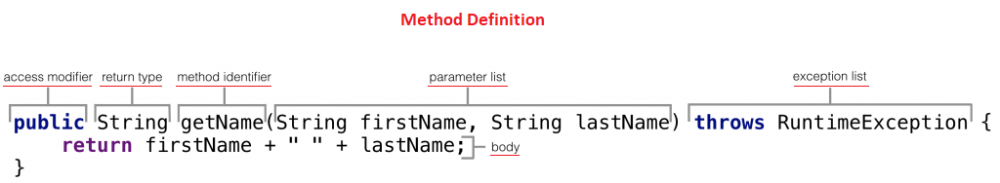

### A method consists of six parts:

- **Access modifier** — optionally we can specify from wherein the code one can access the method;
- **Return type** — _Required_ — the type of the value returned by the method, if any;
- **Method identifier** —  _Required_ — the name we give to the method;
- **Parameter list** — an optional comma-separated list of inputs for the method;
- **Exception list** — an optional list of exceptions the method can throw;
- **Body** —  _Required_ — definition of the logic (can be empty).

> **Method signature**  — the **method's name** and the **parameter types**.
>
> The **parameter names** don't influence the method signature.

> **Method Overloading** — two or more methods with the **different method signatures**.
>
> You cannot declare more than one method with the **same name** and the **same number** and **type
> of arguments**, because the compiler cannot tell them apart.

> **Type Erasure** changes the effective signature, with generic parameters.

```java
public class OverloadingErrors<T extends Serializable> {

    public void printElement(T t) { // cause collision
        System.out.println("Signature is: printElement(T)");
    }

    public void printElement(Serializable o) {
        System.out.println("Signature is: printElement(Serializable)");
    }
}
```

### ///// References (online):

- [The Java™ Tutorials: Defining Methods](https://docs.oracle.com/javase/tutorial/java/javaOO/methods.html)
- [Methods in Java](https://www.baeldung.com/java-methods)
- [Does a Method’s Signature Include the Return Type in Java?](https://www.baeldung.com/java-method-signature-return-type)

[^ up](#knowledge-notes)

---

## Abstract Class vs Interface

### Interface

```java
interface Brain extends Serializable, Cloneable {

    int number = 1;

    void talk(String name); // public abstract by default

    void doProgramming();

    default void doRoutine() {
        // carry out normal day-to-day duties
    }
}
```

- all methods can have `static`, `default` or `abstract` modifiers (since Java 8). Implicitly they are `public abstract`
  .
- methods can be implemented (can have a code body) if it is declared `static` or `default`. `Abstract` methods cannot
  have a body only method signature (since Java 8).
- variables are not allowed. Any data declaration is `public static final` (constants).
- can extend other interfaces (one or more) but not classes (abstract or not).
- cannot be instantiated as they are not concrete classes.
- methods and constants cannot be declared `private`, methods cannot be declared `final`.

### Abstract class

```java
abstract class Car extends SecurityManager implements Serializable, Cloneable {

    public static int wheels = 4;

    private final boolean isTankFull = false;

    protected void turn(String direction) {
        System.out.println("Turning" + direction);
    }

    public abstract void startWithSound(String sound);

    public abstract void shutdown();
}
```

- can be without having any methods inside it. But if it has any methods inside it, it must have at least one `abstract`
  method. This rule does not apply to `static` methods.
- can have both **abstract** and **non abstract** methods, hence the `abstract` modifier is necessary here (unlike
  in `interface` where only `abstract` methods are allowed).
- `static` members are allowed.
- can extend other at most one `abstract` or concrete `class` and implement several `interfaces`.
- any class that does not implement all the `abstract` methods of it's `super` class has to be an `abstract` class
  itself.

### ///// References (online):

* [Interface vs Abstract class vs Concrete class](https://medium.com/heuristics/interface-vs-abstract-class-vs-concrete-class-196f20c3af9a)
* [Choosing Between an Interface and an Abstract Class](https://betterprogramming.pub/choosing-between-interface-and-abstract-class-7a078551b914)
* [Easiest explanation of Abstract class and Interface](https://medium.com/@alifabdullah/easiest-explanation-of-abstract-class-and-interface-280741bc2daf)
* [Abstract class vs interface in Kotlin](https://blog.kotlin-academy.com/abstract-class-vs-interface-in-kotlin-5ab8697c3a14)

[^ up](#knowledge-notes)

---

## Java Nested Classes

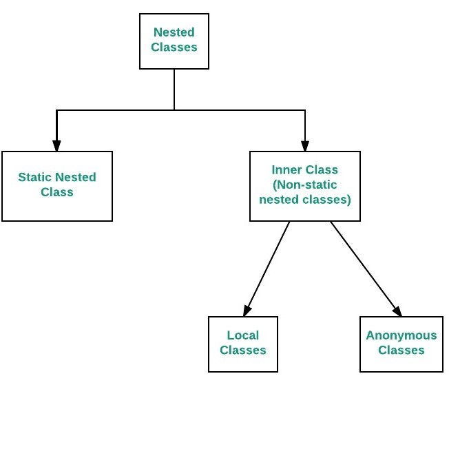

The Java programming language allows you to define a class within another class. Such a class is called a **nested
class**. The nested class can be declared `private`, `public`, `protected`, or `package-private(default)`.

```java
class OuterClass { // The outer class can be only `public` or `package-private(default)`

    //region Nested Classes
    class InnerClass {
        // ...
    }

    static class StaticNestedClass {
        // ...
    }
    //endregion
}
```

### Nested classes are divided into two categories:

- ### Non-Static — _"Inner Classes"_

  An **instance** of `InnerClass` can exist only within an **instance** of `OuterClass` and has direct access to the
  methods and fields of its **enclosing instance**.

  To instantiate an inner class, you must first instantiate the outer class. Then, create the inner object within the
  outer object.

    ```java
    class NestedClassExample {
    
        public static void main(String[] args) {
            OuterClass outerObject = new OuterClass();
            OuterClass.InnerClass innerObject = outerObject.new InnerClass();
        }
    }
    ```

  ### There are two special kinds of inner classes:

    - **Local Classes** — When the inner classes are declared within the body of a method. Local classes are similar to
      inner classes.

    - **Anonymous Classes** — When the inner classes are declared within the body of a method without naming the class.
      An anonymous class is an expression. It must be part of a statement.

- ### Static — _"Static Nested Classes"_

  A `StaticInnerClass` cannot refer directly to instance variables or methods defined in `OuterClass`: it can use
  them **only through an object reference**. A `StaticInnerClass` interacts with the instance members of
  its `OuterClass` (and other classes) just like any other top-level class.

    ```java
    class NestedClassExample {
      
        public static void main(String[] args) {
            StaticInnerClass staticInnerObject = new StaticInnerClass();
        }
    }
    ```

### Why Use Nested Classes?

- **It is a way of logically grouping classes that are only used in one place:**
  If a class is useful to only one other class, it is logical to embed it in that class and keep the two together.
  Nesting such "helper classes" makes their package more streamlined.

- **It increases encapsulation:** Consider two top-level classes, A and B, where B needs access to members of A that
  would otherwise be declared private. By hiding class B within class A, A's members can be declared private and B can
  access them. In addition, B itself can be hidden from the outside world.

- **It can lead to more readable and maintainable code:** Nesting small classes within top-level classes places the code
  closer to where it is used.

### Inner Class and Nested Static Class Example

```java
class OuterClass {

    private static final String staticOuterStr = "staticOuterStr";
    private final String outerStr = "outerStr";

    private static void staticOuterFoo() {
    }

    private void outerFoo() {

        //innerFoo(); // Does not have access to the members of the nested class
        //staticInnerFoo(this); // Does not have access to the static members of the nested class

        InnerClass innerClass = new InnerClass();
        String innerStr = innerClass.innerStr;
        innerClass.innerFoo();

        StaticInnerClass staticInnerClass = new StaticInnerClass();
        String innerStr2 = staticInnerClass.innerStr;
        String staticInnerStr = StaticInnerClass.staticInnerStr;
    }

    private class InnerClass {

        //static String staticInnerStr = ""; // Cannot have static members
        private final String innerStr = outerStr;

        //static void staticInnerFoo() {}  // Cannot have static members

        private void innerFoo() {
            staticOuterFoo();
            outerFoo();
        }
    }

    static class StaticInnerClass {

        private static final String staticInnerStr = "staticInnerStr";
        //String innerStr = outerStr; // Cannot make a static reference to the non-static
        private final String innerStr = new OuterClass().outerStr; // only from outer class instance

        //static void staticInnerFoo() {}  // Cannot have static members

        private static void staticInnerFoo(OuterClass outerClass) {
            staticOuterFoo();
            //outerFoo(); // Non-static method cannot be referenced from a static context
            outerClass.outerFoo(); // only from outer class instance
        }
    }

    public static void main(String[] args) {

        StaticInnerClass staticInnerObject = new StaticInnerClass();
        //InnerClass innerObject = new InnerClass();
        InnerClass innerObject = new OuterClass().new InnerClass();
    }
}
```

### ///// References (online):

* [The Java™ Tutorials: Nested Classes](https://docs.oracle.com/javase/tutorial/java/javaOO/nested.html)
* [The Java™ Tutorials: Local Classes](https://docs.oracle.com/javase/tutorial/java/javaOO/localclasses.html)
* [The Java™ Tutorials: Anonymous Classes](https://docs.oracle.com/javase/tutorial/java/javaOO/anonymousclasses.html)
* [Do You Know Nested and Inner Classes in Java?](https://medium.com/javarevisited/do-you-know-nested-and-inner-classes-in-java-cc5647f46e07)

[^ up](#knowledge-notes)

---

## Class Object

```java
public class Object {

    /**
     * Returns the runtime class of this Object.
     * The returned Class object is the object that is locked
     * by static synchronized methods of the represented class.
     * The actual result type is Class<? extends |X|> where |X|
     * is the erasure of the static type of the expression on which getClass is called.
     */
    public final native Class<?> getClass();

    /**
     * Returns a hash code value for the object.
     * The general contract of hashCode() is:
     * - Whenever it is invoked on the same object more than once,
     *   the hashCode method must return the same integer, provided
     *   no information is modified.
     * - If two objects are equal according to the equals(Object) method,
     *   then calling the hashCode method must produce the same integer result.
     * - It is not required that if two objects are unequal according to
     *   the equals(Object) method, then calling the hashCode method must
     *   produce distinct integer results.
     * Returns: a hash code value for this object.
     */
    public native int hashCode();

    /**
     * Indicates whether some other object is "equal to" this one.
     * The equals(Object) method implements an equivalence relation
     * on NON-NULL object references:
     * - x.equals(x) should return true.
     * - x.equals(y) should return true if y.equals(x) returns true.
     * - If x.equals(y) returns true and y.equals(z) returns true,
     *   then x.equals(z) should return true.
     * - Multiple invocations of x.equals(y) return true (or false),
     *   provided no information is modified.
     * - x.equals(null) should return false.
     * Params: obj – the reference object with which to compare.
     * Returns: true if this object is the same as the obj argument; false otherwise.
     */
    public boolean equals(Object obj) {
        return (this == obj);
    }

    /**
     * Creates and returns a copy of this object. The precise meaning
     * of "copy" may depend on the class of the object.
     * Returns: a clone of this instance.
     * Throws:  CloneNotSupportedException – if the object's class
     *          does not support the Cloneable interface.
     */
    protected native Object clone() throws CloneNotSupportedException;

    /**
     * Returns a string representation of the object. In general,
     * the toString method returns a string that "textually represents" this object.
     * It is recommended that all subclasses override this method.
     * Returns: a string representation of the object.
     */
    public String toString() {
        return getClass().getName() + "@" + Integer.toHexString(hashCode());
    }

    /**
     * Wakes up a single thread that is waiting on this object's monitor.
     * If any threads are waiting on this object, one of them is chosen
     * to be awakened. The choice is arbitrary and occurs at the discretion
     * of the implementation.
     * This method should only be called by a thread that is the owner of
     * this object's monitor.
     * Only one thread at a time can own an object's monitor.
     * Throws:  IllegalMonitorStateException – if the current thread
     *          is not the owner of this object's monitor.
     */
    public final native void notify();

    /**
     * Wakes up all threads that are waiting on this object's monitor.
     * A thread waits on an object's monitor by calling one of the wait methods.
     * This method should only be called by a thread that is the owner of
     * this object's monitor.
     * Throws:  IllegalMonitorStateException – if the current thread
     *          is not the owner of this object's monitor.
     */
    public final native void notifyAll();

    /**
     * Causes the current thread to wait until it is awakened,
     * typically by being notified or interrupted.
     * Throws:  IllegalMonitorStateException – if the current thread
     *          is not the owner of the object's monitor
     *          InterruptedException – if any thread interrupted the current thread
     *          before or while the current thread was waiting.
     *          The interrupted status of the current thread is cleared
     *          when this exception is thrown.
     */
    public final void wait() throws InterruptedException {
        wait(0L);
    }

    /**
     * Causes the current thread to wait until it is awakened,
     * typically by being notified or interrupted, or until
     * a certain amount of real time has elapsed.
     * Params:  timeoutMillis – the maximum time to wait, in milliseconds
     * Throws:  IllegalArgumentException – if timeoutMillis is negative
     *          IllegalMonitorStateException – if the current thread
     *          is not the owner of the object's monitor
     *          InterruptedException – if any thread interrupted the current thread
     *          before or while the current thread was waiting.
     *          The interrupted status of the current thread is cleared
     *          when this exception is thrown.
     */
    public final native void wait(long timeoutMillis) throws InterruptedException;

    /**
     * Causes the current thread to wait until it is awakened,
     * typically by being notified or interrupted, or until
     * a certain amount of real time has elapsed.
     * The current thread must own this object's monitor lock.
     * Params:  timeoutMillis – the maximum time to wait, in milliseconds
     *          nanos – additional time, in nanoseconds, in the range 0-999999 inclusive
     * Throws:  IllegalArgumentException – if timeoutMillis is negative,
     *          or if the value of nanos is out of range
     *          IllegalMonitorStateException – if the current thread
     *          is not the owner of the object's monitor
     *          InterruptedException – if any thread interrupted
     *          the current thread before or while the current thread was waiting.
     *          The interrupted status of the current thread
     *          is cleared when this exception is thrown.
     * API Note:    The recommended approach to waiting is to check
     *              the condition being awaited in a while loop around
     *              the call to wait, as shown in the example below.
     *              Among other things, this approach avoids problems
     *             that can be caused by spurious wakeups.
     */
    public final void wait(long timeoutMillis, int nanos) throws InterruptedException {
        if (timeoutMillis < 0) {
            throw new IllegalArgumentException("timeoutMillis value is negative");
        }

        if (nanos < 0 || nanos > 999999) {
            throw new IllegalArgumentException(
                    "nanosecond timeout value out of range");
        }

        if (nanos > 0) {
            timeoutMillis++;
        }

        wait(timeoutMillis);
    }

    /**
     * Called by the garbage collector on an object when garbage collection
     * determines that there are no more references to the object.
     * A subclass overrides the finalize method to dispose of system
     * resources or to perform other cleanup.
     * The finalize method of class Object performs no special action;
     * it simply returns normally. Subclasses of Object may override this definition.
     * The finalize method is never invoked more than once by a Java
     * virtual machine for any given object.
     * Deprecated   The finalization mechanism is inherently problematic.
     *              Finalization can lead to performance issues, deadlocks, and hangs.
     *              Errors in finalizers can lead to resource leaks;
     *              there is no way to cancel finalization if it is no longer necessary;
     *              and no ordering is specified among calls to finalize
     *              methods of different objects.
     * Throws:      Throwable – the Exception raised by this method
     */
    @Deprecated(since = "9")
    protected void finalize() throws Throwable {
    }
}
```

### ///// References (online):

* [Class Object](https://docs.oracle.com/javase/7/docs/api/java/lang/Object.html)

[^ up](#knowledge-notes)

---

## Data Types

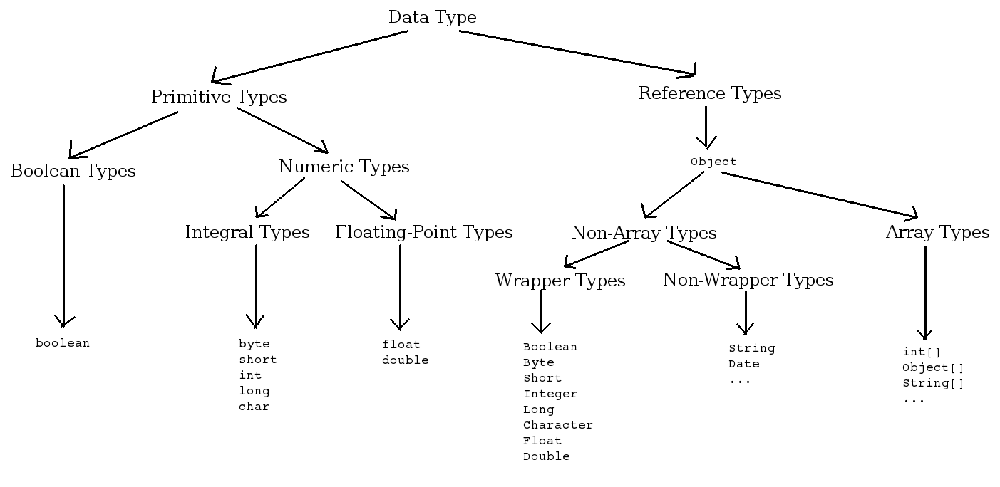

### Primitive Data Types


### ///// References (online):

* [Data types in Java](https://www.geeksforgeeks.org/data-types-in-java/)
* [Primitive Data Types and What Default Values Are Assigned to Them in Java?](https://medium.com/javarevisited/primitive-data-types-in-java-and-what-default-values-are-assigned-to-them-take-a-look-7d5f0e8083e4)
* [StackOverflow: Are wrappers of a primitive type primitives types too?](https://stackoverflow.com/questions/48304498/are-wrappers-of-a-primitive-type-primitives-types-too)

[^ up](#knowledge-notes)

---

## String Pool

String Pool is a place in the Heap memory of Java to store string literal. To decrease the number of String objects
created in the JVM, the String class keeps a pool of strings.

Why strings are immutable:

* Use of String Constant Pool (caching the String literals)
* Security
* Thread-Safety
* Cacheable HashCode
* Improved Performance

String objects are created in two ways:

1. ### Using double quotes(" "):

   ```java
   class StringPoolExample {
    String stringLiteral = "String literal";
   }
   ```

   The above statement first searches for the string `“String literal”` in the string pool, if found it just gives it a
   reference `stringLiteral` from string pool. If not found it creates a string object and places it in the string pool
   and then gives it a reference `stringLiteral`.

   > In this case, **only one object is created**: in the `string pool`.

2. ### Using the 'new' keyword:

   ```java
   class StringPoolExample {
    String newString = new String("New string");
   }
   ```

   The above statement creates a string object in heap memory, returns a reference from heap memory and checks whether
   it is present in the string pool or not. If the string “New string” is not present in the string pool then it will
   place this string in the string pool (JVM will point to that string object) else it will skip it.

   > _Case 1:_ **Two objects are created**: one in the `heap memory` and the other in the `string pool`.
   >
   > _Case 2:_ **Only one object is created**: in the `heap memory`.

### String.intern()

When the `String.intern()` method is invoked, if the `string pool` already contains a string equal to this String
object (the object with which intern method is being called) , then the string from the `string pool` is returned.
Otherwise, this String object is added to the `string pool`, and a reference to this String object in `string pool` is
returned.

### ///// References (online):

* [Concept of String Pool And String Object Creation In Java](https://medium.com/nerd-for-tech/concept-of-string-pool-and-string-object-creation-in-java-27ed2b3089f5)
* [String Pool in Java? Number of Objects Created When ‘Literals’ or ‘New’ Used?](https://medium.com/javarevisited/what-does-string-pool-mean-in-java-414c725fbd59)

[^ up](#knowledge-notes)

---

## Java Generics

Generics were introduced in JDK 5.0 to provide **compile-time type checking** and to eliminate the risk of
`ClassCastException` that was common when working with collection classes earlier.

A programmer can restrict a collection class to contain only one type of object using **Generics**.

Generic code ensures **type safety**. The compiler uses **type-erasure** to remove all type parameters at the
compile-time to reduce the overload at runtime.

```java
public interface List<E> {
    void add(E x);

    Iterator<E> iterator();
}

public interface Iterator<E> {
    E next();

    boolean hasNext();
}

public interface IntegerList {
    void add(Integer x);

    Iterator<Integer> iterator();
}
```

The parameters in the angle brackets in the front of `List` and `Iterator` interfaces (`<E>`) are the declarations of
the **Formal Type Parameters** of the interfaces `List` and `Iterator`.

When a generic declaration is invoked, the **Actual Type Arguments** are substituted for the **Formal Type Parameters**.

The **Formal Type Parameter** (`E`) in this case is an **Unbounded Type Parameter** and can take any values
like `Integer`, `Long`, `Double`, `String` or **any custom class name**.

### Type Safety

It’s just a guarantee by compiler that if correct Types are used in correct places then there should not be any
`ClassCastException` in runtime.

### Type Erasure

It essentially means that all the extra information added using generics into source code will be removed from bytecode
generated from it. Inside bytecode, it will be old java syntax which you will get if you don’t use generics at all. This
necessarily helps in generating and executing code written prior to Java 5.0 when generics were not added in language.

### Java Generic Type naming conventions:

- **E** — Element (used extensively by the Java Collections Framework, for example, `ArrayList`, `Set`, etc.)
- **K** — Key (Used in `Map`)
- **N** — Number
- **T** — Type
- **V** — Value (Used in `Map`)

### Invariant

First, generic types in Java are invariant, meaning that `List<String>` is **not a subtype of** `List<Object>`.
If `List` were not invariant, it would have been no better than `Array`, as the following code would have compiled but
caused an exception at runtime:

```java
public class GenericsExample {

    public static void main(String[] args) {
        List<String> strs = new ArrayList<String>();
        List<Object> objs = strs; // !!! A compile-time error here saves us from a runtime exception later.
        objs.add(1); // Put an Integer into a list of Strings
        String s = strs.get(0); // !!! ClassCastException: Cannot cast Integer to String
    }
}
```

### Bounded Type Parameters in Generics

When we restrict generic type declaration (`<E>`) to have certain classes that are called **Bounded Type Parameters**.

```java
public class Hardware<T extends Machine> {
}

class Machine {
}

class Laptop extends Machine {
}

class Mobile extends Machine {
}
```

In the above example, the **generic type of Hardware class** can be a **Machine class** or **subclasses of a Machine**.

Hence,`T` can have only one out of three values: `Machine`, `Laptop`, or `Mobile`.

### Generics with Wildcards (?)

In generic code, the question mark (`?`), called the wildcard, represents an unknown type. A wildcard parameterized type
is an instantiation of a generic type where at least one type argument is a wildcard.

Examples of wildcard parameterized types:

- `Collection<?>` — **Unbounded wildcard parameterized type**. Denotes all instantiations of the `Collection` interface
  without any restriction on the type argument.
- `List<? extends Number>` — **Upper bounded wildcard parameterized type**. Denotes all list types where the element
  type is a subtype of `Number` or a type `Number` itself.
- `Comparator<? super String>`— **Lower bounded wildcard parameterized type**. Denotes all instantiations of
  the `Comparator` interface for type argument types that are supertypes of `String` or the type `String` itself.

```java
public class GenericsExamples {

    public static void main(String[] args) {

        Object anyObject = new Object();
        Number anyNumber = 1;
        int anyInt = 2;
        byte anyByte = Byte.parseByte("3");

        //region Invariance
        List<Object> listObject_ListObject = new ArrayList<Object>();
        //List<Object> listObject_ListNumber = new ArrayList<Number>();   // error - can assign only exactly <Object>
        //List<Object> listObject_ListInteger = new ArrayList<Integer>();   // error - can assign only exactly <Object>
        //List<Object> listObject_ListByte = new ArrayList<Byte>();   // error - can assign only exactly <Object>

        //List<Number> listNumber_ListObject = new ArrayList<Object>();  // error - can assign only exactly <Number>
        List<Number> listNumber_ListNumber = new ArrayList<Number>();
        //List<Number> listNumber_ListInteger = new ArrayList<Integer>(); // error - can assign only exactly <Number>
        //List<Number> listNumber_ListByte  = new ArrayList<Byte>(); // error - can assign only exactly <Number>

        //List<Integer> listInteger_ListObject  = new ArrayList<Object>(); // error - can assign only exactly <Integer>
        //List<Integer> listInteger_ListNumber  = new ArrayList<Number>(); // error - can assign only exactly <Integer>
        List<Integer> listInteger_ListInteger = new ArrayList<Integer>();
        //List<Integer> listInteger_ListByte  = new ArrayList<Byte>(); // error - can assign only exactly <Integer>

        // operations of reading (producing)
        anyObject = listObject_ListObject.get(0);
        //anyNumber = listObject_ListObject.get(0); // error - not safe to get Number
        //anyInt = listObject_ListObject.get(0); // error - not safe to get Integer
        //anyByte = listObject_ListObject.get(0); // error - not safe to get Byte

        anyObject = listNumber_ListNumber.get(0);
        anyNumber = listNumber_ListNumber.get(0);
        //anyInt = listNumber_ListNumber.get(0); // error - not safe to get Integer
        //anyByte = listNumber_ListNumber.get(0); // error - not safe to get Byte

        anyObject = listInteger_ListInteger.get(0);
        anyNumber = listInteger_ListInteger.get(0);
        anyInt = listInteger_ListInteger.get(0);
        //anyByte = listInteger_ListInteger.get(0); // error - not safe to get Byte

        // operations of setting (consuming)
        listObject_ListObject.add(anyObject); // ok - allowed to add Object to exactly List<Object>
        listObject_ListObject.add(anyInt); // ok - allowed to add Object, Number, Integer, Byte to exactly List<Object>

        //listNumber_ListNumber.add(anyObject); // error - not allowed to add Object to exactly List<Number>
        listNumber_ListNumber.add(anyNumber); // ok - allowed to add Number to exactly List<Number>
        listNumber_ListNumber.add(anyInt); // ok - allowed to add Integer to exactly List<Number>
        listNumber_ListNumber.add(anyByte); // ok - allowed to add Byte to exactly List<Number>

        //listInteger_ListInteger.add(anyObject); // error - not allowed to add Object to exactly List<Integer>
        //listInteger_ListInteger.add(anyNumber); // error - not allowed to add Number to exactly List<Integer>
        listInteger_ListInteger.add(anyInt); // ok - allowed to add Integer to exactly List<Integer>
        //listInteger_ListInteger.add(anyByte); // error - not allowed to add Byte to exactly List<Integer>
        //endregion

        //region Covariance
        List<? extends Object> listExtendsObject_ListObject = new ArrayList<Object>();
        List<? extends Object> listExtendsObject_ListNumber = new ArrayList<Number>();
        List<? extends Object> listExtendsObject_ListInteger = new ArrayList<Integer>();
        List<? extends Object> listExtendsObject_ListByte = new ArrayList<Byte>();

        //List<? extends Number> listExtendsNumber_ListObject = new ArrayList<Object>(); // error - Object is not a subclass of Number
        List<? extends Number> listExtendsNumber_ListNumber = new ArrayList<Number>();
        List<? extends Number> listExtendsNumber_ListInteger = new ArrayList<Integer>();
        List<? extends Number> listExtendsNumber_ListByte = new ArrayList<Byte>();

        //List<? extends Integer> listExtendsInteger_ListObject  = new ArrayList<Object>(); // error - Object is not a subclass of Integer
        //List<? extends Integer> listExtendsInteger_ListNumber  = new ArrayList<Number>(); // error - Number is not a subclass of Integer
        List<? extends Integer> listExtendsInteger_ListInteger = new ArrayList<Integer>();
        //List<? extends Integer> listExtendsInteger_ListByte  = new ArrayList<Byte>(); // error - Byte is not a subclass of Integer

        // operations of reading (producing)
        anyObject = listExtendsNumber_ListNumber.get(0);
        anyNumber = listExtendsNumber_ListNumber.get(0);
        //anyInt = listExtendsNumber_ListNumber.get(0); // error - not safe to get Integer
        //anyByte = listExtendsNumber_ListNumber.get(0); // error - not safe to get Byte

        anyObject = listExtendsInteger_ListInteger.get(0);
        anyNumber = listExtendsInteger_ListInteger.get(0);
        anyInt = listExtendsInteger_ListInteger.get(0);
        //anyByte = listExtendsInteger_ListInteger.get(0); // error - not safe to get Byte

        // operations of setting (consuming)
        //listExtendsObject_ListObject.add(anyObject);  // error - can't add Object to *possible* List<Byte>, even though it is really List<Object>

        // These next 3 are compile errors for the same reason:
        // You don't know what kind of List<T> is really being referenced - it may not be able to hold an Integer.
        // You can't add anything (not Object, Number, Integer, nor Byte) to List<? extends Number>
        //listExtendsNumber_ListNumber.add(anyInt); // error - can't add Integer to *possible* List<Byte>, even though it is really List<Number>
        //listExtendsNumber_ListInteger.add(anyInt); // error - can't add Integer to *possible* List<Byte>, even though it is really List<Integer>
        //listExtendsNumber_ListByte.add(anyInt); // error - can't add Integer to *possible* List<Byte>, especially since it is really List<Byte>

        // This fails for same reason above - you can't guarantee what kind of List the variable is really pointing to
        //listExtendsInteger_ListInteger.add(anyInt); // error - can't add Integer to *possible* List<X> that is only allowed to hold X's
        //endregion

        //region Contravariance
        List<? super Object> listSuperObject_ListObject = new ArrayList<Object>();
        //List<? super Object> listSuperObject_ListNumber = new ArrayList<Number>(); // error - Integer is not superclass of Object
        //List<? super Object> listSuperObject_ListInteger = new ArrayList<Integer>(); // error - Integer is not superclass of Object
        //List<? super Object> listSuperObject_ListByte  = new ArrayList<Byte>(); // error - Byte is not superclass of Object

        List<? super Number> listSuperNumber_ListObject = new ArrayList<Object>();
        List<? super Number> listSuperNumber_ListNumber = new ArrayList<Number>();
        //List<? super Number> listSuperNumber_ListInteger = new ArrayList<Integer>(); // error - Integer is not superclass of Number
        //List<? super Number> listSuperNumber_ListByte  = new ArrayList<Byte>(); // error - Byte is not superclass of Number

        List<? super Integer> listSuperInteger_ListObject = new ArrayList<Object>();
        List<? super Integer> listSuperInteger_ListNumber = new ArrayList<Number>();
        List<? super Integer> listSuperInteger_ListInteger = new ArrayList<Integer>();
        //List<? super Integer> listSuperInteger_ListByte  = new ArrayList<Byte>(); // error - Byte is not a superclass of Integer

        // operations of reading (producing)
        anyObject = listSuperNumber_ListNumber.get(0);
        //anyNumber = listSuperNumber_ListNumber.get(0); // error - not allowed to get Number to List<Number> or List<Object>
        //anyInt = listSuperNumber_ListNumber.get(0); // error - not allowed to get Integer to List<Number> or List<Object>
        //anyByte = listSuperNumber_ListNumber.get(0); // error - not allowed to get Byte to List<Number> or List<Object>

        anyObject = listSuperInteger_ListInteger.get(0);
        //anyNumber = listSuperInteger_ListInteger.get(0); // error - not allowed to get Number to List<Integer>, List<Number>, or List<Object>
        //anyInt = listSuperInteger_ListInteger.get(0); // error - not allowed to get Integer to List<Integer>, List<Number>, or List<Object>
        //anyByte = listSuperInteger_ListInteger.get(0); // error - not allowed to get Byte to List<Integer>, List<Number>, or List<Object>

        // operations of setting (consuming)
        //listSuperNumber_ListNumber.add(anyObject); // error - not allowed to add Object to List<Number> or List<Object>
        listSuperNumber_ListNumber.add(anyNumber); // ok - allowed to add Number to List<Number> or List<Object>
        listSuperNumber_ListNumber.add(anyInt); // ok - allowed to add Integer to List<Number> or List<Object>
        listSuperNumber_ListNumber.add(anyByte); // ok - allowed to add Byte to List<Number> or List<Object>

        //listSuperInteger_ListInteger.add(anyObject); // error - not allowed to add Object to List<Integer>, List<Number>, or List<Object>
        //listSuperInteger_ListInteger.add(anyNumber); // error - not allowed to add Number to List<Integer>, List<Number>, or List<Object>
        listSuperInteger_ListInteger.add(anyInt); // ok - allowed to add Integer to List<Integer>, List<Number>, or List<Object>
        //listSuperInteger_ListInteger.add(anyByte); // error - not allowed to add Byte to List<Integer>, List<Number>, or List<Object>
        //endregion
    }
}
```

### Not allowed to do with Generics:

1. #### You can’t have static field of type

    ```java
    class GenericsExample<T> {
        private static T member; //Not allowed
    }
    ```

2. #### You can not create an instance of T

    ```java
    class GenericsExample<T> {
        public GenericsExample(){
            new T(); //Not allowed
        }
    }
    ```

3. #### Generics are not compatible with primitives in declarations

    ```java
    class GenericsExample<T> {
        List<int> ids = new ArrayList<>(); //Not allowed
    }
    ```

4. #### You can’t create Generic exception class

    ```java
    // causes compiler error
    public class GenericException<T> extends Exception {
    }
    ```

5. #### The `super` bound is not allowed in class, interface or method definition

    ```java
    //this code does not compile !
    class Forbidden<X super Vehicle> {
        <X super Vehicle> void foo() {
        }
    }
    ```

### ///// References (online):

* [Java Generics Tutorial](https://howtodoinjava.com/java/generics/complete-java-generics-tutorial/)
* [Java Generics: Why Are They Used?](https://medium.com/javarevisited/java-generics-why-are-they-used-4157734de4fd)
* [StackOverflow: How can I add to List<? extends Number> data structures?](https://stackoverflow.com/questions/2776975/how-can-i-add-to-list-extends-number-data-structures)
* [An introduction to generic types in Java: covariance and contravariance](https://medium.com/free-code-camp/understanding-java-generic-types-covariance-and-contravariance-88f4c19763d2)
* [Java Generics FAQs](http://www.angelikalanger.com/GenericsFAQ/JavaGenericsFAQ.html)
* [StackOverflow: Why super keyword in generics is not allowed at class level](https://stackoverflow.com/questions/37411256/why-super-keyword-in-generics-is-not-allowed-at-class-level/37411519#37411519)
* [Пришел, увидел, обобщил: погружаемся в Java Generics](https://habr.com/en/company/sberbank/blog/416413/)

[^ up](#knowledge-notes)

***

# Java Collections


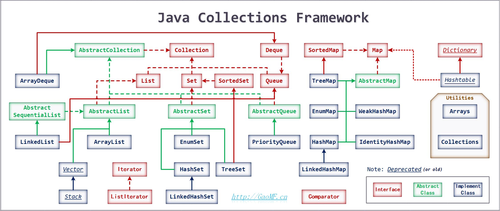

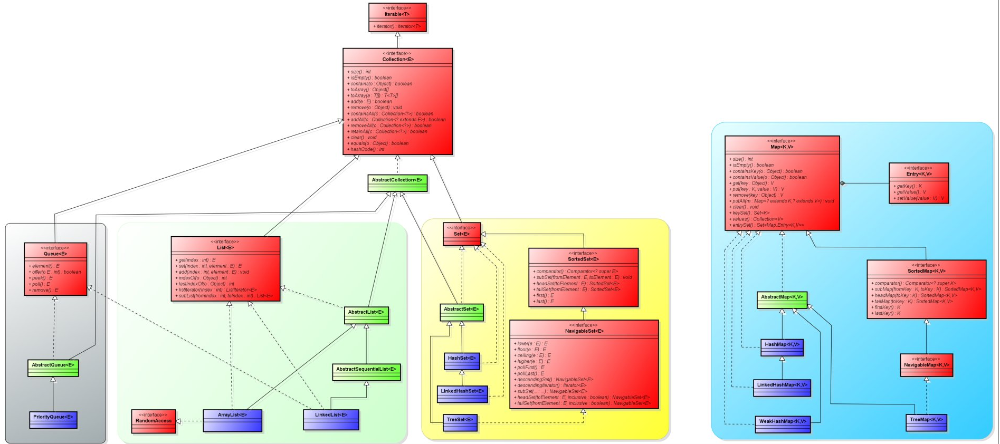

# Java Interface Collection

# Java Interface Map

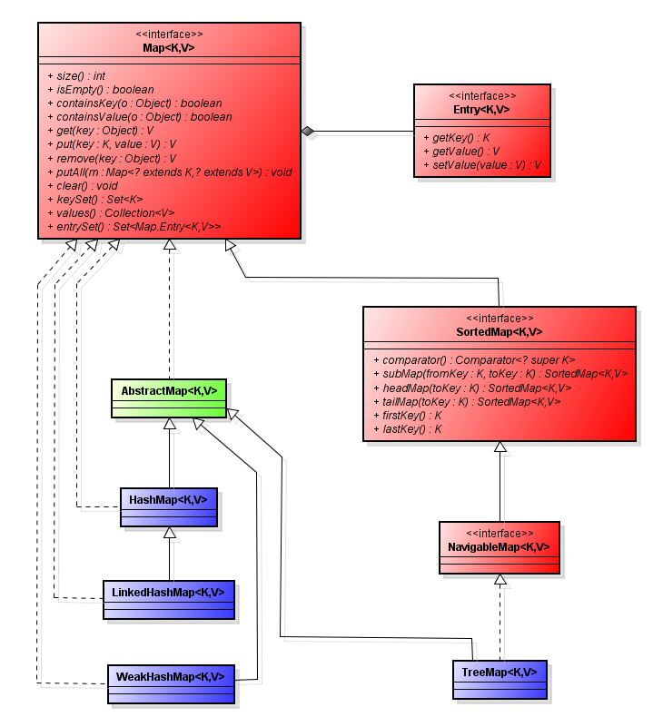

## Java HashMap

### Important points:

* `HashMap` uses its static inner class `Node<K,V>` for storing the entries into the map.
* `HashMap` allows at most one `null` key and multiple `null` values.
* The `HashMap` class does not preserve the order of insertion of entries into the map.
* `HashMap` has multiple buckets or bins which contain a head reference to a singly linked list. That means there would
  be as many linked lists as there are buckets. Initially, it has a bucket size of 16 which grows to 32 when the number
  of entries in the map crosses the 75%. (That means after inserting in 12 buckets bucket size becomes 32)
* `HashMap` is almost similar to `Hashtable` except that it’s unsynchronized and allows at max one `null` key and
  multiple `null` values.
* `HashMap` uses `hashCode()` and `equals()` methods on keys for the get and put operations. So `HashMap` key objects
  should provide a good implementation of these methods.
* That’s why the Wrapper classes like `Integer` and `String` classes are a good choice for keys for `HashMap` as they
  are immutable and their object state won’t change over the course of the execution of the program.

### Time Complexity:

* **O(1)** － time for `search`, `insertion`, and `deletion` operations for good **in a fairly distributed** hashMap.
* **O(n)** － time for `search`, `insertion`, and `deletion` operations in **the worst case**, where all the entries go
  to the same bucket and the **singly linked list** stores these entries.
* **O(log(n))** － time for `search`, `insertion`, and `deletion` operations In a case where the threshold for converting
  this linked list to a **self-balancing binary search tree** (i.e. AVL/Red black) is used.

### Internal Working:

1. `HashMap` uses its **static inner class** `Node<K,V>` for storing map entries. That means each entry in hashMap is
   a `Node`. Internally `HashMap` uses a hashCode of the key `Object` and this hashCode is further used by the hash
   function to find the index of the bucket where the new entry can be added.
2. `HashMap` uses multiple buckets and each bucket points to a **Singly Linked List** where the entries (nodes) are
   stored.
3. Once the bucket is identified by the hash function using hashcode, then hashCode is used to check if there is already
   a key with the same hashCode or not in the bucket (**singly linked list**).
4. If there already exists a key with the same hashCode, then the `equals()` method is used on the keys. If
   the `equals()` method returns true, that means there is already a node with the same key and hence the value against
   that key is overwritten in the entry(node), otherwise, a new node is created and added to this Singly Linked List of
   that bucket.
5. If there is no key with the same hashCode in the bucket found by the hash function then the new `Node` is added into
   the bucket found.

### HashMap Node Structure

* ### Regular Node Structure:

  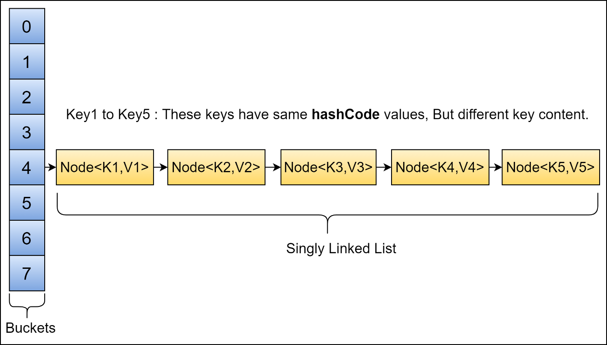

* ### Since Java 8 it transforms into a self-balancing BST when the threshold is reached (default threshold = 8):

  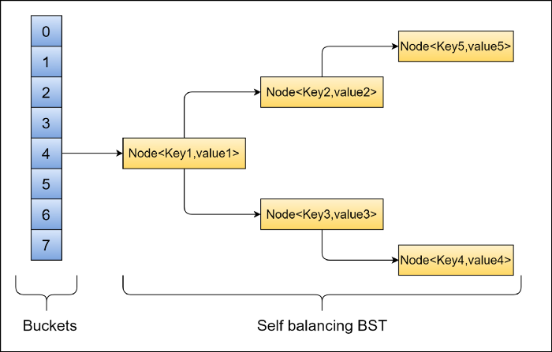

## ///// References (online):

* [Class HashMap<K,V>](https://docs.oracle.com/javase/8/docs/api/java/util/HashMap.html)
* [How HashMap works in Java](https://howtodoinjava.com/java/collections/hashmap/how-hashmap-works-in-java/)
* [Comparing HashMap and ConcurrentHashMap in Java](https://medium.com/javarevisited/comparing-hashmap-and-concurrenthashmap-in-java-e131769c2eec)
* [HashMap and Hashtable](https://medium.com/@nhphung216/hashmap-and-hashtable-5e1ebbc88c29)
* [Java Collection Framework Analysis 1](https://www.programmersought.com/article/41504190986/)

[^ up](#knowledge-notes)

---

## Java HashTable

It is similar to `HashMap`.

### The differences between a `HashMap` and `Hashtable` in Java:

- `HashMap` is non synchronized. `Hashtable` is synchronized.
- `HashMap` allows one `null` key and multiple `null` values. `Hashtable` doesn't allow any `null` key or value.
- `HashMap` is fast. `Hashtable` is slow due to added synchronization.
- `HashMap` is traversed by `Iterator`. `Hashtable` is traversed by `Enumerator` and `Iterator`.
- `Iterator` in `HashMap` is fail-fast. `Enumerator` in `Hashtable` is not fail-fast.
- `HashMap` inherits `AbstractMap` class. `Hashtable` inherits `Dictionary` class.

## ///// References (online):

* [Java Hashtable class](https://howtodoinjava.com/java/collections/hashtable-class/)

[^ up](#knowledge-notes)

---

## ///// References (online):

* [Collections in Java](https://howtodoinjava.com/java-collections/)

***

# Concurrency

## Java Thread

In concurrent programming, there are two basic units of execution: processes and threads. A process has a self-contained
execution environment. A process generally has a complete, private set of basic run-time resources; in particular, each
process has its own memory space.

A `Thread` is a lightweight Process. Both processes and threads provide an execution environment, but creating a new
thread requires fewer resources than creating a new process.

Threads exist within a process — every process has at least one.

### Create new Thread:

1. #### Provide a Runnable object

    ```java
    public class HelloRunnable implements Runnable {
    
        public void run() {
            System.out.println("Hello from a thread!");
        }
    
        public static void main(String[] args) {
            (new Thread(new HelloRunnable())).start();
        }
    
    }
    ```

2. #### Extending the Thread Class.

   The Thread class itself implements Runnable, though its run method does nothing.

    ```java
    public class HelloThread extends Thread {
    
        public void run() {
            System.out.println("Hello from a thread!");
        }
    
        public static void main(String[] args) {
            (new HelloThread()).start();
        }
    
    }
    ```

3. #### Implementing the Callable Interface

   To create the thread, a `Runnable` is required. To obtain the result, a `Future` is required.

   The Java library has the concrete type `FutureTask`, which implements `Runnable` and `Future`, combining both
   functionality conveniently. A `FutureTask` can be created by providing its constructor with a `Callable`. Then
   the `FutureTask` object is provided to the constructor of `Thread` to create the `Thread` object. Thus, indirectly,
   the thread is created with a `Callable`. For further emphasis, note that **there is no way to create the thread
   directly with a Callable**.

    ```java
    public class CallableExample implements Callable {
    
        public Object call() {

            Random generator = new Random();
            Integer randomNumber = generator.nextInt(5);
            Thread.sleep(randomNumber * 1000);
    
            return randomNumber;
        }
    }
  
    public class CallableFutureTest {
  
        public static void main(String[] args) {
            
            FutureTask[] randomNumberTasks = new FutureTask[5];
            
            for (int i = 0; i < 5; i++) {
                Callable callable = new CallableExample();
                randomNumberTasks[i] = new FutureTask(callable);
                Thread t = new Thread(randomNumberTasks[i]);
                t.start();
            }
    
            for (int i = 0; i < 5; i++) {
                System.out.println(randomNumberTasks[i].get());
                // As it implements Future, we can call get()
                // This method blocks till the result is obtained
                // The get method can throw checked exceptions
                // like when it is interrupted. This is the reason
                // for adding the throws clause to main
            }
        }
    }
    ```

4. #### By using the Executor Framework along with Runnable and Callable Tasks

   Executor provides a way of decoupling task submission from the mechanics of how each task will be run, including
   details of thread use, scheduling, etc. An `Executor` is normally used instead of explicitly creating threads. The
   command may execute in a new thread, in a pooled thread, or in the calling thread, at the discretion of
   the `Executor`
   implementation.

    ```java
    public class HelloExecutor {
    
        public static Executor executor;
    
        public static void main(String[] args) {
            executor.execute(new RunnableTask1());
            executor.execute(new RunnableTask2());
        }
    }  
    ```

### Thread states:


- **NEW** — A NEW Thread is a thread that’s been created but not yet started.
- **RUNNABLE** — Threads in this state are either running or ready to run, but they’re waiting for resource allocation
  from the system.
- **WAITING** — Waiting for some other thread to perform a particular action without any time limit.
- **TIMED_WAITING** — Waiting for some other thread to perform a specific action for a specified amount of time.
- **BLOCKED** — Waiting to acquire a lock to enter or re-enter a synchronized block/method.
- **TERMINATED** — When thread has either finished execution or was terminated abnormally. Once a thread is terminated,
  it cannot be resumed.

### Liveness

A concurrent application's ability to execute in a timely manner is known as its liveness.

- **Deadlock** — describes a situation where two or more threads are blocked forever, waiting for each other.
- **Starvation** — describes a situation where a thread is unable to gain regular access to shared resources and is
  unable to make progress.
- **Livelock** — A thread often acts in response to the action of another thread. If the other thread's action is also a
  response to the action of another thread, then livelock may result. As with deadlock, livelocked threads are unable to
  make further progress. However, the threads are not blocked — they are simply too busy responding to each other to
  resume work.

### Thread Class vs Runnable Interface

* If we extend the `Thread` class, our class cannot extend any other class because Java doesn't support multiple
  inheritance. But, if we implement the Runnable interface, our class can still extend other base classes.
* We can achieve basic functionality of a thread by extending `Thread` class because it provides some inbuilt methods
  like
  `yield()`, `interrupt()` etc. that are not available in `Runnable` interface.
* Using `Runnable` will give you an object that can be shared amongst multiple threads.

### Callable vs Runnable

* For implementing `Runnable`, the `run()` method needs to be implemented which does not return anything, while for a
  `Callable`, the `call()` method needs to be implemented which returns a result on completion. Note that a thread can’t
  be created with a Callable, it can only be created with a `Runnable`.
* Another difference is that the `call()` method can throw an exception whereas `run()` cannot.

### ///// References (online):

* [Java Threads - Creating Threads and Multithreading in Java](https://medium.com/edureka/java-thread-bfb08e4eb691)
* [Callable and Future in Java](https://www.geeksforgeeks.org/callable-future-java/)
* [How to Implement Callable Interface in Java](https://www.edureka.co/blog/callable-interface-in-java/)
* [Java Concurrency: How To Create A Thread](https://medium.com/javarevisited/java-concurrency-how-to-create-a-thread-a760bac60d27)
* [Java Concurrency: Thread Life Cycle](https://medium.com/javarevisited/java-concurrency-thread-life-cycle-4869432474b)
* [Java Concurrency: Thread Methods](https://medium.com/javarevisited/java-concurrency-thread-methods-54d12545c825)

[^ up](#knowledge-notes)

---

## Lock vs Monitor

### Lock

**A lock is kind of data which is logically part of an object’s header on the heap memory.** Each object in a JVM has
this lock (or mutex) that any program can use to coordinate multi-threaded access to the object. If any thread want to
access instance variables of that object; then thread must “own” the object’s lock (set some flag in lock memory area).
All other threads that attempt to access the object’s variables have to wait until the owning thread releases the
object’s lock (unset the flag).

### Monitor

**Monitor is a synchronization construct that allows threads to have both mutual exclusion (using locks) and
cooperation** i.e. the ability to make threads wait for certain condition to be true (using **wait-set**). In other
words, along with data that implements a lock, every Java object is logically associated with data that implements a
wait-set.


### ///// References (online):

* [What is a Monitor in Computer Science?](https://www.baeldung.com/cs/monitor)
* [Difference between lock and monitor – Java Concurrency](https://howtodoinjava.com/java/multi-threading/multithreading-difference-between-lock-and-monitor/)
* [Object level lock vs Class level lock in Java](https://howtodoinjava.com/java/multi-threading/object-vs-class-level-locking/)
* [StackOverflow: Difference: this vs MyClass.class vs MyClass.getClass() in synchronisation](https://stackoverflow.com/questions/51839363/difference-this-vs-myclass-class-vs-myclass-getclass-in-synchronisation)
* [IllegalMonitorStateException in Java](https://www.baeldung.com/java-illegalmonitorstateexception)

[^ up](#knowledge-notes)

---

## Synchronized vs Volatile vs Atomic

### Synchronized

- Provides **mutual exclusion** - two threads can not run a synchronized method or block at the same time. Though beware
  of using static and non-static synchronized methods together.
- Provides **visibility guaranteed** - updated values of variables modified inside synchronized context will be visible
  to all threads.
- A synchronized keyword also provides **blocking**. A thread will block until the lock is available, before entering to
  code protected by a synchronized keyword.
- As per the **happens-before rule**, an unlock on a monitor happens-before every subsequent lock on the same monitor.


- **Synchronizing Instance Method:** a thread acquires **the lock of this object**, any new thread cannot call any of **
  the synchronized methods** of the same object.
- **Synchronizing Static Method:** a thread acquires **the lock associated with the class**, any other thread will not
  be able to call any **static synchronized method** but will be able to call **non-static(instance) synchronized
  method** of an instance of that class. **The object-level lock is still available**.
- **Synchronized Block Inside Instance Method:** we have to provide a reference of the object (`this`
  or `any other reference`) so that a thread can acquire the lock and release it after executing the synchronized block.
- **Synchronized Block Inside The Static Method:** It is similar to synchronizing the block inside the instance method.
  The only difference is to provide the lock at a **class level using `ClassName.class`** as a parameter for the
  synchronized block.

### Volatile

- It provides a **visibility guarantee**. As per the happens-before rule, write to volatile variable happens before
  every subsequent read of the same variable.
- It also prevents Compiler from doing smart things, which can create problems in a multi-threading environment, like
  caching variables, re-ordering of code, etc.

### Atomic classes like AtomicInteger, AtomicLong, and AtomicReference

- Atomic variables also provides the same memory semantics as a volatile variable, but with an added feature of
  making **compound action** atomic.
- It provides a convenient method to perform atomic increment, decrement, **CAS (compare-and-swap) operations**. Useful
  methods are `addAndGet(int delta)`, `compareAndSet(int expect, int update)`, `incrementAndGet()` and
  `decrementAndGet()`

### ///// References (online):

* [Difference between atomic, volatile and synchronized in Java](https://javarevisited.blogspot.com/2020/04/difference-between-atomic-volatile-and-synchronized-in-java-multi-threading.html#axzz79ky1D7bi)
* [StackOverflow: What is the difference between atomic / volatile / synchronized?](https://stackoverflow.com/questions/9749746/what-is-the-difference-between-atomic-volatile-synchronized)
* [Java Concurrency: Volatile](https://medium.com/javarevisited/java-concurrency-volatile-d0e585852d6b)
* [Java Concurrency: Synchronized](https://medium.com/javarevisited/java-concurrency-synchronized-7828bf5f06cb)
* [Synchronization in Java: All You Need to Know](https://levelup.gitconnected.com/synchronization-in-java-all-you-need-to-know-7bd27219ce10)

[^ up](#knowledge-notes)

---

## Executors

In large-scale applications, it makes sense to separate thread management and creation from the rest of the application.
Objects that encapsulate these functions are known as **executors**.

### UML Diagram of Executor framework:

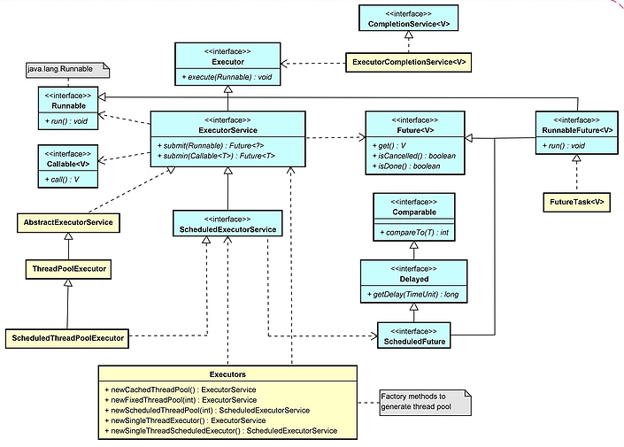

### Executor Interfaces:

- ### The Executor Interface

  The `Executor` interface supports launching new tasks. It provides a single method `execute()`. The definition
  of `execute()` is less specific. The low-level idiom creates a new thread and launches it immediately. Depending on
  the `Executor` implementation, `execute()` may do the same thing, but is more likely to use an existing worker thread
  to run `Runnable` object, or to place `Runnable` object in a queue to wait for a worker thread to become available.

- ### The ExecutorService Interface

  The `ExecutorService` interface supplements `execute()` with a similar, but a more versatile `submit()` method.
  Like `execute()`, `submit()` accepts `Runnable` objects, but also accepts `Callable` objects, which allow the task to
  return a value. The `submit()` method returns a `Future` object, which is used to retrieve the `Callable` return value
  and to manage the status of both `Callable` and `Runnable` tasks.

  `ExecutorService` also provides methods for submitting large collections of `Callable` objects.
  Finally, `ExecutorService` provides a number of methods for managing the shutdown of the executor. To support the
  immediate shutdown, tasks should handle interrupts correctly.

    ```java
    class ExecutorServiceExample {
    
        public static void main(String[] args) {
            // The easiest way to create ExecutorService is to use
            // one of the factory methods of the Executors class.
            // Create a thread-pool with 10 threads.
            ExecutorService executorService = Executors.newFixedThreadPool(10);
    
            // The execute() method is void, and it doesn't give any possibility
            // to get the result of task’s execution or to check
            // the task’s status (is it running or executed).
            executorService.execute(runnableTask);
    
            // The submit() submits a Callable or a Runnable task to an ExecutorService
            // and returns a result of type Future.
            Future<String> future = executorService.submit(callableTask);
    
            // The invokeAny() assigns a collection of tasks to an ExecutorService,
            // causing each to be executed, and returns the result of a successful
            // execution of one task (if there was a successful execution).
            String result = executorService.invokeAny(callableTasks);
    
            // The invokeAll() assigns a collection of tasks to an ExecutorService,
            // causing each to be executed, and returns the result of all
            // task executions in the form of a list of objects of type Future.
            List<Future<String>> futures = executorService.invokeAll(callableTasks);
    
            // The ExecutorService will not be automatically destroyed
            // when there is no task to process. It will stay alive
            // and wait for new work to do.
    
            // The shutdown() method doesn't cause immediate destruction of
            // the ExecutorService. It will make the ExecutorService stop
            // accepting new tasks and shut down after all running threads
            // finish their current work.
            executorService.shutdown();
    
            // The shutdownNow() method tries to destroy the ExecutorService
            // immediately, but it doesn't guarantee that all the running threads
            // will be stopped at the same time. This method returns a list
            // of tasks that are waiting to be processed.
            List<Runnable> notExecutedTasks = executorService.shutdownNow();
        }
    }
    ```

- ### The ScheduledExecutorService Interface

  The `ScheduledExecutorService` interface supplements the methods of its parent `ExecutorService` with schedule, which
  executes a `Runnable` or `Callable` task after a specified delay. In addition, the interface
  defines `scheduleAtFixedRate` and `scheduleWithFixedDelay`, which executes specified tasks repeatedly, at defined
  intervals.

### Thread Pools

Since active threads consume system resources, a JVM creating too many threads at the same time can cause the system to
run out of memory. This necessitates the need to limit the number of threads being created.

Most of the executor implementations in `java.util.concurrent` use **thread pools**, which consist of _worker threads_.
This kind of thread exists separately from the `Runnable` and `Callable` tasks it executes and is often used to execute
multiple tasks.

Using worker threads minimizes the overhead due to thread creation. Thread objects use a significant amount of memory,
and in a large-scale application, allocating and deallocating many thread objects creates a significant memory
management overhead.

- ### Fixed Thread Pool

  One common type of thread pool is the fixed thread pool. This type of pool always has a specified number of threads
  running. Instead of starting a new thread for every task to execute concurrently, the task can be passed to a thread
  pool. As soon as the pool has any idle threads the task is assigned to one of them and executed. Internally the tasks
  are inserted into a `BlockingQueue` which the threads in the pool are dequeuing from. When a new task is inserted into
  the queue one of the idle threads will dequeue it successfully and execute it. The rest of the idle threads in the
  pool will be blocked waiting to dequeue tasks. Invoke `newFixedThreadPool(int numberOfThreads)` method to create it.

- ### Cached Thread Pool

  This is an expandable thread pool (0 worker threads at the beginning). This does not have fixed size of threads. This
  is suitable for application which have a lot of short live tasks. When coming new task to the cached thread pool, if
  all the threads are busy, cached thread pool is created new thread for that new task. If thread is idle for 1 minute,
  it will terminate those threads. Invoke `newCachedThreadPool()` method to create it.

- ### Scheduled Thread Pool

  If you need to schedule the task after certain delay, this is the thread pool for it. If you need a check security
  check, login check within every 10 seconds, we can use scheduled thread pool.
  Invoke `newScheduledThreadPool(int corePoolSize)` method to create it.

- ### Single Thread Executor

  Here, only one thread is using in the thread pool. All the tasks are keeping in blocking queue. After finishing task,
  it fetches new task from the queue and execute it. Invoke `newSingleThreadExecutor()` method to create it.

### ///// References (online):

* [Java Concurrency: Executors](https://medium.com/javarevisited/java-concurrency-executors-fa2307ed7f80)
* [Java Multithread Executor Framework <Callable, Future, Executor and Executor Service>](https://programmer.help/blogs/5d312fd63b7b0.html)
* [Java Concurrency: Thread Pools](https://medium.com/javarevisited/java-concurrency-thread-pools-3f1902b7beee)
* [Executor Service(Java Thread Pool Framework)](https://pramodshehan.medium.com/executor-service-java-thread-pool-framework-d314b12ca043)
* [Executor Framework- Understanding the basics (Part 1)](https://medium.com/android-news/executor-framework-understanding-the-basics-43d575e72310)
* [Executor Framework- Understanding the basics (Part 2)](https://medium.com/android-news/executor-framework-understanding-the-basics-part-2-bc3427fa8e2f)
* [How to use the Executor Framework in Java](https://levelup.gitconnected.com/how-to-use-the-executor-framework-in-java-58a610d20b87)
* [How to use Java Callable and Future](https://levelup.gitconnected.com/how-to-use-java-callable-and-future-5d79ecb47c8b)

[^ up](#knowledge-notes)

---

## ///// References (online):

* [Java Tutorial Lesson: Concurrency](https://docs.oracle.com/javase/tutorial/essential/concurrency/)
* [Многопоточность в Java](https://habr.com/ru/post/164487/)
* [Обзор java.util.concurrent.*](https://habr.com/ru/company/luxoft/blog/157273/)
* [Справочник по синхронизаторам java.util.concurrent.*](https://habr.com/ru/post/277669/)

[^ up](#knowledge-notes)

---

## Java Concurrent Collections

### Java ConcurrentHashMap

Basically, it is a `HashTable` implementation, that supports concurrent retrieval and updates in the map.

### Important points:

* doesn't allow `null` for keys and values.
* operations are **thread-safe**.
* supports concurrent access to it’s key-value pairs by design.
* allows multiple threads to work independently on different segments in the map.
* allows modification while iterating over it.
* no need to lock the map to read a value.

### ///// References (online):

* [Comparing HashMap and ConcurrentHashMap in Java](https://medium.com/javarevisited/comparing-hashmap-and-concurrenthashmap-in-java-e131769c2eec)

[^ up](#knowledge-notes)

---

### Java SynchronizedHashMap

`SynchronizedHashMap` works very similar to `ConcurrentHashMap`.

### Important points:

* allows only one thread to perform read/write operations at a time because all of its methods are declared
  **synchronized**.
* a lock is required for read operation.
* returns `Iterator`, which fails-fast on concurrent modification.

### ///// References (online):

* [Synchronize HashMap – ConcurrentHashMap](https://howtodoinjava.com/java/collections/hashmap/synchronize-hashmap/)

[^ up](#knowledge-notes)

***

# JVM

## JVM Architecture

JVM is only a specification, and its implementation is different from vendor to vendor.


### 1. Class Loader Subsystem

The JVM resides on the RAM. During execution, using the Class Loader subsystem, the class files are brought on to the
RAM. This is called Java’s dynamic class loading functionality. It loads, links, and initializes the class file (.class)
when it refers to a class for the first time at runtime (not compile time).

- #### Loading
  Loading compiled classes (.class files) into memory is the major task of Class Loader. Usually, the class loading
  process starts from loading the main class (i.e. class with static main() method declaration). All the subsequent
  class loading attempts are done according to the class references in the already-running classes

- #### Linking
  Linking involves in verifying and preparing a loaded class or interface, its direct superclasses and superinterfaces,
  and its element type as necessary, while following the below properties.

- #### Initialization
  Here, the initialization logic of each loaded class or interface will be executed (e.g. calling the constructor of a
  class). This is the final phase of class loading where all the static variables are assigned with their original
  values defined in the code and the static block will be executed (if any). This is executed line by line from top to
  bottom in a class and from parent to child in class hierarchy.

### 2. Runtime Data Area

Runtime Data Areas are the memory areas assigned when the JVM program runs on the OS. In addition to reading .class
files, the Class Loader subsystem generates corresponding binary data and save the information (*fully qualified name of
the loaded class, .class file is related to a Class/Interface/Enum Modifiers, static variables, and method etc.*) in the
Method area for each class separately. Then, for every loaded .class file, it creates exactly one object of Class to
represent the file in the Heap memory as defined in java.lang package. This Class object can be used to read class level
information (class name, parent name, methods, variable information, static variables etc.) later in our code.

- ### Method Area

  This is a shared resource (only 1 method area per JVM). Is not thread safe. Method area stores class level data (
  including static variables) such as:

    - **Classloader reference**.
    - **Run time constant pool** — Numeric constants, field references, method references, attributes.
    - **Field data** — Per field: name, type, modifiers, attributes.
    - **Method data** — Per method: name, return type, parameter types (in order), modifiers, attributes.
    - **Method code** — Per method: bytecodes, operand stack size, local variable size, local variable table, exception
      table.

- ### Heap area

  This is a shared resource (only 1 heap area per JVM). Is not thread safe. Information of all objects and their
  corresponding instance variables and arrays are stored in the Heap area. Heap area is a great target for Garbage
  Collection.

- ### Stack Area

  This is not a shared resource and is thread safe. For every JVM thread, when the thread starts, a separate runtime
  stack gets created in order to store method calls. For every such method call, one entry will be created and added
  (pushed) into the top of runtime stack and such entry is called a _Stack Frame_. The size of stack frame is fixed
  according to the method. The frame is removed (popped) when the method returns normally or if an uncaught exception is
  thrown during the method invocation. After a thread terminates, its stack frame will also be destroyed by JVM.  
  A Stack Frame is divided into three sub-entities:

    - **Local Variable Array** — Variable from index 0 is the reference of a class instance where the method belongs.
      From 1, the parameters sent to the method are saved.
    - **Operand Stack** — Each method exchanges data between the Operand stack and the local variable array, and pushes
      or pops other method invoke results.
    - **Frame Data** — All symbols related to the method are stored here.


- ### Program Counter Registers
  For each JVM thread, when the thread starts, a separate PC Register gets created in order to hold the address of
  currently-executing instruction (memory address in the Method area).


- ### Native Method Stack
  There is a direct mapping between a Java thread and a native operating system thread. A separate native stack also
  gets created in order to store native method information (often written in C/C++) invoked through JNI (Java Native
  Interface).

### 3. Execution Engine

The actual execution of the bytecode occurs here. Execution Engine executes the instructions in the bytecode
line-by-line by reading the data assigned to above runtime data areas.

- ### Interpreter
  It interprets the bytecode and executes the instructions one-by-one.


- ### Just-In-Time (JIT) Compiler
  First, it compiles the entire bytecode to native code (machine code). Then for repeated method calls, it directly
  provides the native code. The native code is stored in the cache, thus the compiled code can be executed quicker.


- ### Garbage Collector (GC)
  As long as an object is being referenced, the JVM considers it alive. Once an object is no longer referenced and
  therefore is not reachable by the application code, the garbage collector removes it and reclaims the unused memory.
  We can trigger it by calling System.gc() method (But the execution is not guaranteed.).

### 4. Java Native Interface (JNI)

This interface is used to interact with Native Method Libraries. This enables JVM to call C/C++ libraries and to be
called by C/C++ libraries which may be specific to hardware.

### 5. Native Method Libraries

This is a collection of C/C++ Native Libraries which is required for the Execution Engine and can be accessed through
the provided Native Interface.

### //// References (online):

* [The Structure of the Java Virtual Machine](https://docs.oracle.com/javase/specs/jvms/se10/html/jvms-2.html)
* [Understanding JVM Architecture](https://medium.com/platform-engineer/understanding-jvm-architecture-22c0ddf09722)

[^ up](#knowledge-notes)

***

## JVM Memory Model


### 1. Heap Memory

It is a larger region of RAM which is used for dynamic memory allocation. All Java objects are stored in the heap and
the scope of the objects is the whole application. The memory management is managed by us in heap, but the unused
objects are cleared by the Garbage collector automatically.


- ### Young Generation
  This is reserved for containing newly-allocated objects Young Gen includes three parts.

    - **Eden Memory** — Most of the newly-created objects goes Eden space. When Eden space is filled with objects, Minor
      Garbage Collection (a.k.a. **Young Collection**) is performed and all the survivor objects are moved to one of the
      survivor spaces.

    - **Survivor Spaces** — Minor Garbage Collection also checks the survivor objects and move them to the other
      survivor space. So at a time, one of the survivor space is always empty. Objects that are survived after many
      cycles of Garbage Collection, are moved to the Old generation memory space. Usually it’s done by setting a
      threshold for the age of the young generation objects before they become eligible to promote to Old generation.
        - **S0 Survivor Space**
        - **S1 Survivor Space**


- ### Old Generation
  This is reserved for containing long-lived objects that could survive after many rounds of Minor Garbage Collection.
  When Old Gen space is full, Major Garbage Collection (a.k.a. **Old Collection**) is performed (usually takes longer
  time).

### 2. Stack

This store's local variables and the partial results. Each thread has its own runtime stack created when the thread is
created. A new frame is created whenever a method is invoked and all the local variables of that method is stored in
that corresponding frame. This is deleted when the method invocation is completed. This is not a shared resource.

### 3. Meta Space

This is part of the native memory and doesn't have an upper limit by default. This is what used to be **Permanent
Generation (PermGen) Space** in earlier versions of JVM. This space is used by the class loaders to store class
definitions. If this space keeps growing, the OS might move data stored here from RAM to virtual memory which might slow
down the application.

### 4. Code Cache

This is where the Just In Time(JIT) compiler stores compiled code blocks that are often accessed. Generally, JVM has to
interpret byte code to native machine code whereas JIT-compiled code need not be interpreted as it is already in native
format and is cached here.

### 5. Shared Libraries

This is where native code for any shared libraries used are stored. This is loaded only once per process by the OS.

### ///// References (online):

* [Understanding Java Memory Model](https://medium.com/platform-engineer/understanding-java-memory-model-1d0863f6d973)
* [JVM Memory Model](https://amanagrawal9999.medium.com/jvm-memory-model-70821e84af4b)
* [Java Memory Explained](https://medium.com/nerd-for-tech/java-memory-explained-43de6de157be)
* [Visualizing memory management in JVM](https://medium.com/@deepu105/visualizing-memory-management-in-jvm-java-kotlin-scala-groovy-clojure-4fbcc0929482)
* [Java Concurrency: Java Memory Model](https://medium.com/javarevisited/java-concurrency-java-memory-model-96e3ac36ec6b)

[^ up](#knowledge-notes)

***

## Stack vs Heap


### ///// References (online):

* [Understanding Java Memory Model](https://medium.com/platform-engineer/understanding-java-memory-model-1d0863f6d973)
* [Стек и куча в Java](https://topjava.ru/blog/stack-and-heap-in-java)

[^ up](#knowledge-notes)

---

## Garbage Collector

Java Garbage Collection (GC) is the process of tracking the live objects while destroying unreferenced objects in the
Heap memory in order to reclaim space for future object allocation. Java Garbage Collector runs as a Daemon Thread (i.e.
a low priority thread that runs in the background to provide services to user threads or perform JVM tasks).

### GC process includes:

* **Mark** — Identifying objects that are currently in use and not in use

* **Normal Deletion** — Removing the unused objects and reclaim the free space

* **Deletion with Compacting** — Moving all the survived objects to one survivor space (to increase the performance of
  allocation of memory to newer objects)

### GC roots:

* Local variables and input parameters of the currently executing methods
* Active Java threads
* Static fields of the loaded classes
* JNI references

### Eligibility cases for GC:

* **Nullifying the reference variable** — When a reference variable of an object are changed to NULL, the object becomes
  unreachable and eligible for GC.

* **Re-assigning the reference variable** — When a reference id of one object is referenced to a reference id of some
  other object, then the previous object will have no reference to it any longer. The object becomes unreachable and
  eligible for GC.

* **Object created inside the method** — When such a method is popped out from the Stack, all its members die and if
  some objects were created inside it, then these objects also become unreachable, thus eligible for GC.

* **Anonymous object** — An object becomes unreachable and eligible for GC when its reference id is not assigned to a
  variable.

* **Objects with only internal references (Island of Isolation)**

### Programmatically Calling GC (no guarantee to run)

* Using **System.gc()** method
* Using **Runtime.getRuntime().gc()** method

### GC Execution Strategies

* ### Serial GC

  Simple mark-sweep-compact approach with young and old gen garbage collections (a.k.a. Minor GC and Major GC). Suitable
  for simple stand-alone client-machine applications running with low memory footprint and less CPU power.

  

* ### Parallel GC

  Parallel version of mark-sweep-compact approach for Minor GC with multiple threads (Major GC still happens with a
  single thread in a serial manner).

  

* ### Concurrent Mark Sweep (CMS) GC

  Garbage collection normally happens with pauses (Major GC takes a long time), which makes it problematic for highly
  responsive applications where we can’t afford long pause times. CMS Collector minimizes the impact of these pauses by
  doing most of the garbage collection work (i.e. Major GC) concurrently within the application threads (Minor GC still
  follows the usual parallel algorithm without any concurrent progress with application threads).

* ### G1 GC

  Garbage First (G1) Collector divides the Heap into multiple equal-sized regions and when GC is invoked, first collects
  the region with lesser live data (young gen and old gen implementations don’t apply here). This collector is a
  parallel, concurrent and incrementally compact low-pause garbage collector which intends to replace the CMS Collector.

  

* ### Shenandoah GC

  Compacting work concurrently within the application threads. Experimental until JDK 15.

* ### Z GC

  All GC processes concurrently within the application threads. Experimental until JDK 15.

### ///// References (online):

* [Understanding Java Garbage Collection](https://medium.com/platform-engineer/understanding-java-garbage-collection-54fc9230659a)
* [Сборка мусора в Java: что это такое и как работает в JVM](https://medium.com/nuances-of-programming/%D1%81%D0%B1%D0%BE%D1%80%D0%BA%D0%B0-%D0%BC%D1%83%D1%81%D0%BE%D1%80%D0%B0-%D0%B2-java-%D1%87%D1%82%D0%BE-%D1%8D%D1%82%D0%BE-%D1%82%D0%B0%D0%BA%D0%BE%D0%B5-%D0%B8-%D0%BA%D0%B0%D0%BA-%D1%80%D0%B0%D0%B1%D0%BE%D1%82%D0%B0%D0%B5%D1%82-%D0%B2-jvm-25bb2570b44c)
* [Дюк, вынеси мусор! — Часть 1](https://habr.com/ru/post/269621/)
* [Дюк, вынеси мусор! — Часть 2](https://habr.com/ru/post/269707/)
* [Дюк, вынеси мусор! — Часть 3](https://habr.com/ru/post/269863/)

[^ up](#knowledge-notes)

---

## Java Reference Types

* ### Strong reference

  Strong references are the ordinary references in Java. Anytime we create a new object, a strong reference is by
  default created.

* ### Soft Reference

  Soft reference objects, which are cleared at the discretion of the garbage collector in response to memory demand.
  Soft references are most often used to implement memory-sensitive caches. A **softly reachable object** has no strong
  references pointing to it. All soft references to softly-reachable objects **are guaranteed to have been cleared
  before a JVM throws an _OutOfMemoryError_**. Softly reachable objects will remain alive for some time after the last
  time they are referenced. The default value is a one second of lifetime per free megabyte in the heap. This value can
  be adjusted.

* ### Weak Reference

  A weakly referenced object is cleared by the Garbage Collector when it's weakly reachable. Weak reachability means
  that an object has neither strong nor soft references pointing to it. First off, the Garbage Collector clears a weak
  reference, so the referent is no longer accessible. Then the reference is placed in a reference queue (if any
  associated exists) where we can obtain it from. At the same time, formerly weakly-reachable objects are going to be
  finalized. One of the best implementations of weak references is the **WeakHashMap**. Reference queue is optional.

* ### Phantom Reference

  These references are only garbage collected when none of the references namely strong references, soft references or
  weak references is being pointed to the object belonging to phantom references. They are always used **along with
  reference queue** and to keep a track of objects which have been finalized. **We can't get a referent of a phantom
  reference: `phantomReference.get()` returns `null`**. One of the use cases is **to determine when an object was
  removed from the memory** which helps to schedule memory-sensitive tasks. For example, we can wait for a large object
  to be removed before loading another one.

### ///// References (online):

* [Soft References in Java](https://www.baeldung.com/java-soft-references)
* [Weak References in Java](https://www.baeldung.com/java-weak-reference)
* [Phantom References in Java](https://www.baeldung.com/java-phantom-reference)
* [Weak Soft and Phantom references in Java and why they matter](https://medium.com/@ramtop/weak-soft-and-phantom-references-in-java-and-why-they-matter-c04bfc9dc792)
* [Finally understanding how references work in Android and Java](https://medium.com/google-developer-experts/finally-understanding-how-references-work-in-android-and-java-26a0d9c92f83)
* [An overview of Strong, Weak, Soft and Phantom references in Java](https://prateeknima.medium.com/strong-weak-soft-and-phantom-references-in-java-b4f9068e883e)
* [Особенности PhantomReference](https://javarush.ru/groups/posts/2291-osobennosti-phantomreference)
* [Мягкие ссылки на страже доступной памяти или как экономить память правильно](https://habr.com/ru/post/169883/)

[^ up](#knowledge-notes)

***

# Kotlin

# Kotlin Basics

## Kotlin Nested Classes

In Kotlin, an `OuterClass` does not see private members of its `InnerClass`. In Java see.

```kotlin
class OuterClass {
    private val outerStr = "outerStr"
    private fun outerFoo() {
        val innerClass: InnerClass = InnerClass()
        //val innerStr = innerClass.innerStr // Cannot access to private members
        //innerClass.innerFoo() // Cannot access to private members
        val staticInnerClass = StaticInnerClass()
        //val innerStr2 = staticInnerClass.innerStr // Cannot access to private members
        //val staticInnerStr = StaticInnerClass.staticInnerStr // Cannot access to private members
    }

    private inner class InnerClass {
        //static val staticInnerStr = ""; // Cannot have static members
        private val innerStr = outerStr

        //static staticInnerFoo() {}  // Cannot have static members
        private fun innerFoo() {
            staticOuterFoo()
            outerFoo()
        }
    }

    class StaticInnerClass {
        //val innerStr = outerStr; // Cannot make a static reference to the non-static
        private val innerStr = OuterClass().outerStr // only from outer class instance

        companion object {
            private const val staticInnerStr = "staticInnerStr"

            //static staticInnerFoo() {}  // Cannot have static members
            private fun staticInnerFoo(outerClass: OuterClass) {
                staticOuterFoo()
                //outerFoo(); // Non-static method cannot be referenced from a static context
                outerClass.outerFoo() // only from outer class instance
            }
        }
    }

    companion object {
        private const val staticOuterStr = "staticOuterStr"
        private fun staticOuterFoo() {}

        @JvmStatic
        fun main(args: Array<String>) {
            val staticInnerObject = StaticInnerClass()
            //val innerObject1 = InnerClass(); // Constructor of inner class can be called only with receiver of containing class
            val innerObject = OuterClass().InnerClass()
        }
    }
}
```

### ///// References (online):

* [Nested and inner classes](https://kotlinlang.org/docs/nested-classes.html)
* [Visibility modifiers](https://kotlinlang.org/docs/visibility-modifiers.html)

[^ up](#knowledge-notes)

---

## Class Any

In Kotlin theAny type represents the super type of all **non-nullable** types.

```kotlin
/**
 * The root of the Kotlin class hierarchy. Every Kotlin class has `Any` as a superclass.
 */
open class Any {
    /**
     * Indicates whether some other object is "equal to" this one. Implementations must fulfil the following
     * requirements:
     *
     * - Reflexive: for any non-null value `x`, `x.equals(x)` should return true.
     * - Symmetric: for any non-null values `x` and `y`, `x.equals(y)` should return true if
     *              and only if `y.equals(x)` returns true.
     * - Transitive:    for any non-null values `x`, `y`, and `z`, if `x.equals(y)` returns true
     *                  and `y.equals(z)` returns true, then `x.equals(z)` should return true.
     * - Consistent:    for any non-null values `x` and `y`, multiple invocations of
     *                  `x.equals(y)` consistently return true or consistently return false,
     *                  provided no information used in `equals` comparisons
     *                  on the objects is modified.
     * - Never equal to null:   for any non-null value `x`, `x.equals(null)` should return false.
     *
     * Read more about [equality](https://kotlinlang.org/docs/reference/equality.html) in Kotlin.
     */
    open operator fun equals(other: Any?): Boolean

    /**
     * Returns a hash code value for the object.  The general contract of `hashCode` is:
     *
     * - Whenever it is invoked on the same object more than once, the `hashCode` method must
     * consistently return the same integer, provided no information used in `equals`
     * comparisons on the object is modified.
     * - If two objects are equal according to the `equals()` method, then calling the
     * `hashCode` method on each of the two objects must produce the same integer result.
     */
    open fun hashCode(): Int

    /**
     * Returns a string representation of the object.
     */
    open fun toString(): String
}

```

It differs to Java’s Object in 2 main things:

- In Java, primitives types aren't type of the hierarchy, so you need to box them implicitly, while in Kotlin
  `Any` is a super type of all types.
- `Any` can’t hold the `null` value, if you need `null` to be part of your variable you can use the type `Any?`
- To use `wait(...)`, `notify()`, `notifyAll()` need to cast a variable to `Object`

### ///// References (online):

* [Kotlin Any](https://kotlinlang.org/api/latest/jvm/stdlib/kotlin/-any/)
* [Kotlin basics: types. Any, Unit and Nothing](https://itnext.io/kotlin-basics-types-any-unit-and-nothing-674cc858035)
* [[Kotlin Pearls 7] Unit, Nothing, Any (and null)](https://proandroiddev.com/kotlin-pearls-7-unit-nothing-any-and-null-cbbbbca86c2d)

[^ up](#knowledge-notes)

---

## Data Classes

```kotlin
data class User(val name: String, val age: Int)
```

```java
// Generated Java bytecode
public final class User {
    @NotNull
    private final String name;
    private final int age;

    @NotNull
    public final String getName() {
        return this.name;
    }

    public final int getAge() {
        return this.age;
    }

    public User(@NotNull String name, int age) {
        Intrinsics.checkNotNullParameter(name, "name");
        super();
        this.name = name;
        this.age = age;
    }

    @NotNull
    public final String component1() {
        return this.name;
    }

    public final int component2() {
        return this.age;
    }

    @NotNull
    public final User copy(@NotNull String name, int age) {
        Intrinsics.checkNotNullParameter(name, "name");
        return new User(name, age);
    }

    // $FF: synthetic method
    public static User copy$default(User var0, String var1, int var2, int var3, Object var4) {
        if ((var3 & 1) != 0) {
            var1 = var0.name;
        }

        if ((var3 & 2) != 0) {
            var2 = var0.age;
        }

        return var0.copy(var1, var2);
    }

    @NotNull
    public String toString() {
        return "User(name=" + this.name + ", age=" + this.age + ")";
    }

    public int hashCode() {
        String var10000 = this.name;
        return (var10000 != null ? var10000.hashCode() : 0) * 31 + Integer.hashCode(this.age);
    }

    public boolean equals(@Nullable Object var1) {
        if (this != var1) {
            if (var1 instanceof User) {
                User var2 = (User) var1;
                return Intrinsics.areEqual(this.name, var2.name) && this.age == var2.age;
            }

            return false;
        } else {
            return true;
        }
    }
}
```

### The compiler automatically derives the following members from all properties declared in the primary constructor:

- `equals()`;

- `hashCode()`;

- `toString() `of the form "User(name=John, age=42)";

- `componentN()` functions corresponding to the properties in their order of declaration;

- `copy()`.

> If there are explicit implementations of `equals()`, `hashCode()`, or `toString()` in the data class body
> or `final` implementations in a superclass, then **these functions are not generated**,
> and the existing implementations are used.

### Data classes requirements:

- The primary constructor needs to have at least **one** parameter.

- All primary constructor parameters need to be marked as `val` or `var`.

- Data classes cannot be `abstract`, `open`, `sealed`, or `inner`.

### Data classes with properties:

```kotlin
data class Person(val name: String) {
    var age: Int = 0
}

val person1 = Person("John")
val person2 = Person("John")
person1.age = 10
person2.age = 20

println(person1 == person2) // true
```

Only the property `name` will be used inside the `toString()`, `equals()`, `hashCode()`, and `copy()` implementations,
and there will only be one component function `component1()`.

> On the JVM, if the generated class needs to have a parameterless constructor,
> default values for the properties have to be specified.
> ```kotlin
> data class User(val name: String = "", val age: Int = 0) // `constructor User()` will be generated
> ```

### ///// References (online):

* [Kotlin Data classes](https://kotlinlang.org/docs/data-classes.html)

[^ up](#knowledge-notes)

---

## Sealed Classes

`Sealed classes` and `interfaces` represent restricted class hierarchies that provide more control over inheritance. All
direct subclasses of a sealed class are known at compile time. No other subclasses may appear after a module with
the `sealed class` is compiled.

The same works for `sealed interfaces` and their implementations: once a module with a `sealed interface` is compiled,
no new implementations can appear.

```kotlin
sealed interface Error

sealed class IOError() : Error

class FileReadError(val f: String) : IOError()
class DatabaseError(val source: String) : IOError()

object RuntimeError : Error
```

```java
// Java compiled bytecode

// Error.java
public interface Error {
}

// IOError.java
public abstract class IOError implements Error {
    private IOError() {
    }

    // $FF: synthetic method
    public IOError(DefaultConstructorMarker $constructor_marker) {
        this();
    }
}

// FileReadError.java
public final class FileReadError extends IOError {
    @NotNull
    private final String f;

    @NotNull
    public final String getF() {
        return this.f;
    }

    public FileReadError(@NotNull String f) {
        Intrinsics.checkNotNullParameter(f, "f");
        super((DefaultConstructorMarker) null);
        this.f = f;
    }
}

// DatabaseError.java
public final class DatabaseError extends IOError {
    @NotNull
    private final String source;

    @NotNull
    public final String getSource() {
        return this.source;
    }

    public DatabaseError(@NotNull String source) {
        Intrinsics.checkNotNullParameter(source, "source");
        super((DefaultConstructorMarker) null);
        this.source = source;
    }
}

// RuntimeError.java
public final class RuntimeError implements Error {
    @NotNull
    public static final RuntimeError INSTANCE;

    private RuntimeError() {
    }

    static {
        RuntimeError var0 = new RuntimeError();
        INSTANCE = var0;
    }
}
```

Direct subclasses of `sealed classes` and `interfaces` must be declared **in the same package**. They may be top-level
or nested inside any number of other named classes, named interfaces, or named objects.

Subclasses of `sealed classes` can't be **local** nor **anonymous objects**.

In some sense, `sealed classes` are similar to `enum classes`: the set of values for an `enum` type is also restricted,
but each enum constant exists only as a **single** instance, whereas a subclass of a sealed class can have **multiple**
instances, each with its own state.

A `sealed class` is `abstract` by itself, it cannot be instantiated directly and can have `abstract` members.

Constructors of `sealed classes` can have one of two visibilities: `protected` (by default) or `private`.

`Enum classes` can't extend a `sealed class` (as well as any other class), but they can implement `sealed interfaces`.

These restrictions don't apply to **indirect** subclasses. If a direct subclass of a `sealed class` is not marked
as `sealed`, it can be extended in any ways that its modifiers allow.

```kotlin
sealed interface Error // has implementations only in same package and module

sealed class IOError() : Error // extended only in same package and module
open class CustomError() : Error // can be extended wherever it's visible
```

### ///// References (online):

- [Sealed Classes](https://kotlinlang.org/docs/sealed-classes.html)

[^ up](#knowledge-notes)

---

# Kotlin Syntax Features

## Kotlin Scope Functions

| Function    | Object reference | Return value  | Is extension function | Usage                                                                                                                                                                                                             |
|-------------|------------------|---------------|-----------------------|-------------------------------------------------------------------------------------------------------------------------------------------------------------------------------------------------------------------|
| `.let{it} ` | `it`             | Lambda result | Yes                   | 1) to invoke one or more functions on results of call chains;<br/>2)  to execute a code block only with non-null values;<br/>3) to introduce local variables with a limited scope for improving code readability. |

```kotlin
val str: String? = "Hello"
val length: Int? = str?.let { nonNullStr -> // it - nonNullStr is `String` && nonNullStr === str
    println("let() called on $nonNullStr")
    nonNullStr.length
    // lambda returns `Int`
}
println(length) // 5 or `null` if str == `null`
```

| Function     | Object reference | Return value  | Is extension function | Usage                                                                                                       |
|--------------|------------------|---------------|-----------------------|-------------------------------------------------------------------------------------------------------------|
| `.run{this}` | `this`           | Lambda result | Yes                   | 1) useful when your lambda contains both the object initialization and the computation of the return value. |

```kotlin
val service = MultiportService("https://example.kotlinlang.org", 80)
val result: QueryResult = service.run { // this: MultiportService
    port = 8080
    query(prepareRequest() + " to port $port")
    // lambda returns `QueryResult` instance
}
```

| Function | Object reference | Return value  | Is extension function | Usage                                                                                  |
|----------|------------------|---------------|-----------------------|----------------------------------------------------------------------------------------|
| `run{}`  | －                | Lambda result | No                    | 1) useful for executing a block of several statements where an expression is required. |

```kotlin
val hexNumberRegex: Regex = run { // no reference to context object
    val digits = "0-9"
    val hexDigits = "A-Fa-f"
    val sign = "+-"
    Regex("[$sign]?[$digits$hexDigits]+")
    // lambda returns `Regex` instance
}
```

| Function     | Object reference | Return value  | Is extension function | Usage                                                                                                                                                                                             |
|--------------|------------------|---------------|-----------------------|---------------------------------------------------------------------------------------------------------------------------------------------------------------------------------------------------|
| `with{this}` | `this`           | Lambda result | No                    | 1) for calling functions on the context object without providing the lambda result;<br/>2) introducing a helper object whose properties or functions will be used for calculating a return value. |

```kotlin
val numbers = mutableListOf("one", "two", "three")
// without providing the lambda result
with(numbers) { // this: MutableList<String>
    println("'with' is called with argument $this")
    println("It contains $size elements")
    // lambda returns the `Unit` kotlin type
}
// with using the context object for lambda result
val firstAndLast: String = with(numbers) { // this: MutableList<String>
    "The first element is ${first()}," +
            " the last element is ${last()}"
    // lambda returns the new `String`
}
```

| Function       | Object reference | Return value   | Is extension function | Usage                                                                                                   |
|----------------|------------------|----------------|-----------------------|---------------------------------------------------------------------------------------------------------|
| `.apply{this}` | `this`           | Context object | Yes                   | 1)  for code blocks that don't return a value and mainly operate on the members of the receiver object. |

```kotlin
val adam = Person("Adam").apply { // this: Person
    age = 32
    city = "London"
    // the same `Person` will be returned
}
```

| Function    | Object reference | Return value   | Is extension function | Usage                                                                                                                                                                              |
|-------------|------------------|----------------|-----------------------|------------------------------------------------------------------------------------------------------------------------------------------------------------------------------------|
| `.also{it}` | `it`             | Context object | Yes                   | 1) use for actions that need a reference rather to the object than to its properties and functions;<br/>2) use when you don't want to shadow `this` reference from an outer scope. |

```kotlin
val numbers = mutableListOf("one", "two", "three")
numbers
    .also { // it: MutableList<String>
        println("The list elements before adding new one: $it")
        // the same `MutableList` will be returned
    }
    .add("four")
```

| Function       | Object reference | Return value           | Is extension function | Usage                                               |
|----------------|------------------|------------------------|-----------------------|-----------------------------------------------------|
| `.takeIf{it}?` | `it`             | Context object, `null` | Yes                   | 1) use as a filtering function for a single object. |

```kotlin
val str = "Hello"
val caps = str.takeIf { it.isNotEmpty() }?.uppercase() ?: "null"
println(caps) // "HELLO"
```

| Function           | Object reference | Return value           | Is extension function | Usage                                               |
|--------------------|------------------|------------------------|-----------------------|-----------------------------------------------------|
| `.takeUnless{it}?` | `it`             | Context object, `null` | Yes                   | 1) use as a filtering function for a single object. |

```kotlin
val str = "Hello"
val caps = str.takeUnless { it.isNotEmpty() }?.uppercase() ?: "null"
println(caps) // "null"
```

### ///// References (online):

- [Scope functions](https://kotlinlang.org/docs/scope-functions.html)

[^ up](#knowledge-notes)

---

## Kotlin Properties

```kotlin
var <propertyName>[: <PropertyType>] [ = <property_initializer>]
[<getter>]
[<setter>]
```

```kotlin
class KotlinPropertiesExample {

    // Getters and setters
    val square: Int
        get() = this.width * this.height // custom getter will be called every time you access the property (implementation a computed property)
    //set() - no setter cause `val`

    var stringRepresentation: String // = "initialization" // Initializer is not allowed here because this property has no backing field
        get() = this.toString()
        set(value) { // is called when you assign a value to the property, except its initialization
            setDataFromString(value) // parses the string and assigns values to other properties
        }

    var setterVisibility: String = "abc"
        private set // the setter is private and has the default implementation

    var setterWithAnnotation: Any? = null
        @Inject set // annotate the setter with Inject

    // Backing fields
    var counter = 0 // the initializer assigns the backing field directly
        set(value) {
            if (value >= 0)
                field = value //The field identifier can only be used in the accessors of the property
            // counter = value // ERROR StackOverflow: Using actual name 'counter' would make setter recursive
        }

    val isEmpty: Boolean //no backing field in this case
        get() = this.size == 0

    // Backing properties
    private var _table: Map<String, Int>? = null // The private property
    val table: Map<String, Int> // The backing property
        get() {
            if (_table == null) {
                _table = HashMap() // Type parameters are inferred
            }
            return _table ?: throw AssertionError("Set to null by another thread")
        }

    // Compile-time constants
    companion object {
        const val CONSTANT: String = "This is constant" // String or primitive type
        //get() = field // Const 'val' should not have a getter
    }

    // Late-initialized properties and variables
    lateinit var subject: TestSubject // non-null type property if you want to avoid null checks when referencing
    val subjectIsInitialized = this::subject.isInitialized // or ::subject.isInitialized
}
```

### ///// References (online):

- [Kotlin Properties](https://kotlinlang.org/docs/properties.html)

[^ up](#knowledge-notes)

---

## Kotlin Delegated Properties

### Delegation pattern

```kotlin
interface Base {
    val message: String
    fun print()
}

class BaseImpl(val x: Int) : Base {
    override val message = "BaseImpl: x = $x"
    override fun print() {
        println(message)
    }
}

class Derived(b: Base) : Base by b {
    // This property is not accessed from b's implementation of `print`
    override val message = "Message of Derived"
}

fun main() {
    val b = BaseImpl(10)
    val derived = Derived(b)
    derived.print() // BaseImpl: x = 10
    println(derived.message) // Message of Derived
}
```

### Standard Delegates

```kotlin
class KotlinStandardDelegatesExamples {
    // Lazy properties
    val lazyValue: String by lazy(LazyThreadSafetyMode.NONE) {
        println("computed!")
        "Hello"
    }

    // Observable properties
    var name: String by Delegates.observable("<no name>") { prop, old, new ->
        // after the assignment has been performed
        println("$old -> $new")
    }

    // Vetoable properties
    var max: Int by Delegates.vetoable(0) { property, oldValue, newValue ->
        // before the assignment has been performed
        if (newValue > oldValue) true else throw IllegalArgumentException("New value must be larger than old value.")
    }

    // Storing properties in a Map
    val map = mapOf("name" to "John", "age" to 25)
    val name: String by map // can be `val` if map is MutableMap
    val age: Int by map // can be `val` if map is MutableMap

    // Local delegated properties
    fun example(computeFoo: () -> Foo) {
        val memoizedFoo by lazy(computeFoo)

        if (someCondition && memoizedFoo.isValid()) {
            // If `someCondition` fails, the `memoizedFoo` won't be computed at all
            memoizedFoo.doSomething()
        }
    }
}
```

### Custom Property Delegate

```kotlin
class Resource

class Owner {
    var varResource: Resource by ResourceDelegate()
}

class ResourceDelegate(private var resource: Resource = Resource()) {

    operator fun getValue(thisRef: Owner, property: KProperty<*>): Resource {
        return resource
    }

    operator fun setValue(thisRef: Owner, property: KProperty<*>, value: Any?) {
        if (value is Resource) {
            resource = value
        }
    }
}

/**
 * Delegate as anonymous objects without creating new classes,
 * by using the interfaces ReadOnlyProperty and ReadWriteProperty
 * from the Kotlin standard library
 */
class OwnerWithAnonymousDelegate {

    fun resourceDelegate(): ReadWriteProperty<Any?, Int> =
        object : ReadWriteProperty<Any?, Int> {
            var curValue = 0
            override fun getValue(thisRef: Any?, property: KProperty<*>): Int = curValue
            override fun setValue(thisRef: Any?, property: KProperty<*>, value: Int) {
                curValue = value
            }
        }

    val readOnly: Int by resourceDelegate()  // ReadWriteProperty as val
    var readWrite: Int by resourceDelegate()
}
```

### Delegating to another property

```kotlin
var topLevelInt: Int = 0

class ClassWithDelegate(val anotherClassInt: Int)

class MyClass(var memberInt: Int, val anotherClassInstance: ClassWithDelegate) {

    var delegatedToMember: Int by this::memberInt
    var delegatedToTopLevel: Int by ::topLevelInt

    val delegatedToAnotherClass: Int by anotherClassInstance::anotherClassInt
}

var MyClass.extDelegated: Int by ::topLevelInt
```

### ///// References (online):

- [Kotlin Delegated Properties](https://kotlinlang.org/docs/delegated-properties.html)
- [Kotlin Delegation](https://kotlinlang.org/docs/delegation.html)
- [Kotlin lazy](https://kotlinlang.org/api/latest/jvm/stdlib/kotlin/lazy.html)
- [Package kotlin.properties](https://kotlinlang.org/api/latest/jvm/stdlib/kotlin.properties/)
- [Делегаты в Kotlin для Android](https://medium.com/nuances-of-programming/%D0%B4%D0%B5%D0%BB%D0%B5%D0%B3%D0%B0%D1%82%D1%8B-%D0%B2-kotlin-%D0%B4%D0%BB%D1%8Fandroid-%D0%B8%D1%81%D0%BF%D0%BE%D0%BB%D1%8C%D0%B7%D1%83%D0%B9%D1%82%D0%B5-%D1%81%D0%B8%D0%BB%D1%83-%D0%B4%D0%B5%D0%BB%D0%B5%D0%B3%D0%B8%D1%80%D0%BE%D0%B2%D0%B0%D0%BD%D0%BD%D1%8B%D1%85-%D1%81%D0%B2%D0%BE%D0%B9%D1%81%D1%82%D0%B2-%D0%B2-%D1%80%D0%B0%D0%B7%D1%80%D0%B0%D0%B1%D0%BE%D1%82%D0%BA%D0%B5-%D0%BF%D0%BE%D0%B4-android-ca4d88d42800)

[^ up](#knowledge-notes)

---

## Kotlin Extensions

Extensions **do not modify** the classes they extend. By defining an extension, you are **not inserting**
new members into a class, only making new functions callable with the dot-notation on variables of this type.

Extension functions are dispatched **statically**, which means they are not virtual by receiver type. An extension
function being called is determined by the type of the expression on which the function is invoked, not by the type of
the result from evaluating that expression at runtime.

### Extension Function

```kotlin
fun <T> MutableList<T>.swap(index1: Int, index2: Int) {
    val tmp = this[index1] // 'this' corresponds to the list
    this[index1] = this[index2]
    this[index2] = tmp
}
```

### Extension Property

```kotlin
val <T> List<T>.lastIndex: Int // initializers are not allowed for extension properties
    get() = size - 1
```

### Companion object extensions

```kotlin
class MyClass {
    companion object {}  // will be called "Companion"
}

fun MyClass.Companion.printCompanion() {
    println("companion")
}

fun main() {
    MyClass.printCompanion()
}
```

### Note on visibility:

- An extension declared at the **top level of a file** has access to the other `private` top-level declarations in the
  same file.

- If an extension is declared **outside its receiver type**, it cannot access the receiver's `private` or `protected`
  members.

### ///// References (online):

- [Kotlin Extensions](https://kotlinlang.org/docs/extensions.html)

[^ up](#knowledge-notes)

---

## Kotlin Generics

```kotlin
class KotlinGenericsExample {

    open class Vehicle
    class Bicycle : Vehicle()
    class StoreProducer<out T> // Covariance
    class StoreConsumer<in T> // Contravariance

    fun main() {
        //var storeProducer_BicycleVehicle: StoreProducer<Bicycle> = StoreProducer<Vehicle>() // Error: Type mismatch
        var storeProducer_BicycleBicycle: StoreProducer<Bicycle> = StoreProducer<Bicycle>()
        var storeProducer_VehicleVehicle: StoreProducer<Vehicle> = StoreProducer<Vehicle>()
        var storeProducer_VehicleBicycle: StoreProducer<Vehicle> = StoreProducer<Bicycle>()

        var storeConsumer_BicycleVehicle: StoreConsumer<Bicycle> = StoreConsumer<Vehicle>()
        var storeConsumer_BicycleBicycle: StoreConsumer<Bicycle> = StoreConsumer<Bicycle>()
        var storeConsumer_VehicleVehicle: StoreConsumer<Vehicle> = StoreConsumer<Vehicle>()
        //var storeConsumer_VehicleBicycle: StoreConsumer<Vehicle> = StoreConsumer<Bicycle>() // Error: Type mismatch
    }
}
```

### Type projections

- #### Use-site variance: type projections

  > Kotlin's `Array<out Any>` corresponds to Java's `Array<? extends Object>`.
  >
  > Kotlin's `Array<in String>` corresponds to Java's `Array<? super String>`.

### Generic constraints

- #### Upper bounds

  > Kotlin's `T : Comparable<T>` corresponds to Java's `extends` keyword.
  >
  >`fun <T : Comparable<T>> sort(list: List<T>) { ... }`
  >
  > The type specified after a colon is the **upper bound**, indicating that only a subtype of `Comparable<T>` can be substituted for `T`.
  >
  > The **default upper bound** (if there was none specified) is `Any?`.

### ///// References (online):

- [Generics: in, out, where](https://kotlinlang.org/docs/generics.html)
- [Generics in Kotlin](https://medium.com/swlh/generics-in-kotlin-5152142e281c)
- [Introduction to Kotlin Generics: Reified Generic Parameters](https://medium.com/kotlin-thursdays/introduction-to-kotlin-generics-reified-generic-parameters-7643f53ba513)
- [Kotlin Covariance and Contravariance](https://medium.com/kotlin-thursdays/introduction-to-kotlin-generics-9d18d3719e1d)
- [Covariance, Contravariance, and Invariance — What do they mean? (Part 1)](https://medium.com/android-news/covariance-contravariance-and-invariance-what-do-they-mean-part-1-351f7865b506)
- [Covariance, Contravariance, and Invariance — What do they mean? (Part 2)](https://medium.com/android-news/covariance-contravariance-and-invariance-what-do-they-mean-part-2-b2111a6e9bbf)
- [Generics & Variance in Java vs Kotlin](https://medium.com/learn-kotlin/generics-variance-in-java-vs-kotlin-c964df6f649b)

[^ up](#knowledge-notes)

***

# Android

# App Components

Each Android app lives in its own security sandbox, protected by the following Android security features:

- The Android operating system is a multi-user Linux system in which each app is a different user.
- By default, the system assigns each app a unique Linux user ID (the ID is used only by the system and is unknown to
  the app). The system sets permissions for all the files in an app so that only the user ID assigned to that app can
  access them.
- Each process has its own virtual machine (VM), so an app's code runs in isolation from other apps.
- By default, every app runs in its own Linux process. The Android system starts the process when any of the app's
  components need to be executed, and then shuts down the process when it's no longer needed or when the system must
  recover memory for other apps.

The Android system implements the principle of least privilege. That is, each app, by default, has access only to the
components that it requires to do its work and no more.

However, there are ways for an app to share data with other apps and for an app to access system services:

- It's possible to arrange for two apps to share the same Linux user ID, in which case they are able to access each
  other's files. To conserve system resources, apps with the same user ID can also arrange to run in the same Linux
  process and share the same VM. The apps must also be signed with the same certificate.
- An app can request permission to access device data such as the device's location, camera, and Bluetooth connection.
  The user has to explicitly grant these permissions.

Each component is an entry point through which the system or a user can enter your app.

## Activity

Unlike programming paradigms in which apps are launched with a `main()` method, the Android system initiates code in an
`Activity` instance by invoking specific callback methods that correspond to specific stages of its lifecycle.

Each activity is only loosely bound to the other activities; there are usually minimal dependencies among the activities
in an app.

To use activities in your app, you must declare the activities, and certain of their attributes, in the manifest, and
you must manage activity lifecycles appropriately.

```java
public class
AppCompatActivity extends FragmentActivity implements AppCompatCallback,
        TaskStackBuilder.SupportParentable, ActionBarDrawerToggle.DelegateProvider {
    //...
}
```

### Managing the activity lifecycle

- ### `onCreate()`

  You must implement this callback. The activity enters the **Created state**. This is where you must
  call `setContentView()` to define the layout for the activity's user interface. This method receives the
  parameter `savedInstanceState`, which is a `Bundle` object containing the activity's previously saved state. If the
  activity has never existed before, the value of the `Bundle` object is `null`.

  Your activity does not reside in the **Created state**. After the `onCreate()` method finishes execution, the activity
  enters the **Started state**.

    ```kotlin
    class MainActivity : AppCompatActivity() {
        override fun onCreate(savedInstanceState: Bundle?) {
            super.onCreate(savedInstanceState)
            setContentView(R.layout.activity_main)
        }
    }
    ```
    ```java
    public final class
    Bundle extends BaseBundle implements Cloneable, Parcelable {
    //...
    }
    ```

- ### `onStart()`

  The activity enters the **Started state**, and the activity becomes visible to the user. This callback contains what
  amounts to the activity’s final preparations for coming to the foreground and becoming interactive.

- ### `onResume()`

  The system invokes this callback just before the activity starts interacting with the user. At this point, the
  activity is at the top of the activity stack, and captures all user input. Most of an app’s core functionality is
  implemented in the `onResume()` method.

- ### `onPause()`

  The system calls `onPause()` when the activity loses focus and enters a **Paused state**. it technically means your
  activity is still partially visible. Even if such activities lose focus, the user expects their UI to continue
  updating. You should **not use** `onPause()` to save application or user data and ets. Once `onPause()` finishes
  executing, the next callback is either `onStop()` or `onResume()`.

- ### `onStop()`

  The system calls `onStop()` when the activity is no longer visible to the user. The activity is being destroyed, a new
  activity is starting, or an existing activity is entering a **Resumed state** and is covering the stopped activity.

  The next callback that the system calls is either `onRestart()`, if the activity is coming back to interact with the
  user, or by `onDestroy()` if this activity is completely terminating.

- ### `onRestart()`

  The system invokes this callback when an activity in the **Stopped state** is about to restart. `onRestart()` restores
  the state of the activity from the time that it was stopped.

- ### `onDestroy()`

  The system invokes this callback before an activity is destroyed.

### Launch Modes

- ### "standard" (the default mode)

  Task1: `A -> B -> C -> D -> B -> B` - creates new instance of the activity multiple times

- ### "singleTop"  (or `Intent.FLAG_ACTIVITY_SINGLE_TOP`)

  Task1: `A -> B -> C -> D -> B` - creates new instance of the activity on the top and then method `onNewIntent()` is
  calling

- ### "singleTask" (or `Intent.FLAG_ACTIVITY_NEW_TASK`)

  Task1: `A -> B -> C -> D`

  Task2: `A -> B` - callback `onNewIntent()` is calling, activities `C`, `D` on top are destroying.

- ### "singleInstance"

  Task1: `A -> B -> C -> E`

  Task2: `D` - callback `onNewIntent()` is calling, activity `D` is always the only activity in task.

### ///// References (online):

- [Android developers: Application Fundamentals](https://developer.android.com/guide/components/fundamentals)
- [Android developers: Introduction to Activities](https://developer.android.com/guide/components/activities/intro-activities)
- [Android developers: Activity](https://developer.android.com/reference/android/app/Activity)
- [Android developers: Tasks and the back stack](https://developer.android.com/guide/components/activities/tasks-and-back-stack#TaskLaunchModes)
- [Understand Android Activity's launchMode: standard, singleTop, singleTask and singleInstance](https://inthecheesefactory.com/blog/understand-android-activity-launchmode/en)
- [Understand Activity Launch Mode With Examples](https://medium.com/@ankit.sinhal/understand-activity-launch-mode-with-examples-721e85b6421e)
- [The Android Lifecycle cheat sheet — part I: Single Activities](https://medium.com/androiddevelopers/the-android-lifecycle-cheat-sheet-part-i-single-activities-e49fd3d202ab)
- [The Android Lifecycle cheat sheet — part II: Multiple activities](https://medium.com/androiddevelopers/the-android-lifecycle-cheat-sheet-part-ii-multiple-activities-a411fd139f24)
- [The Android Lifecycle cheat sheet — part III : Fragments](https://medium.com/androiddevelopers/the-android-lifecycle-cheat-sheet-part-iii-fragments-afc87d4f37fd)
- [The Android Lifecycle cheat sheet — part IV : ViewModels, Translucent Activities and Launch Modes](https://medium.com/androiddevelopers/the-android-lifecycle-cheat-sheet-part-iv-49946659b094)

[^ up](#knowledge-notes)

---

## Service

A `Service` is an application component that can perform long-running operations in the background. It does not provide
a user interface. Once started, a service might continue running for some time, even after the user switches to another
application.

A service runs in the `main thread` of its hosting process; the service **does not create its own thread** and does not
run in a separate process unless you specify otherwise.

### Declaring a service in the manifest

You **must declare** all services in your application's manifest file:

```
<manifest ... >
  ...
  <application ... >
      <service android:description="string resource"
         android:directBootAware=["true" | "false"]
         android:enabled=["true" | "false"]
         android:exported=["true" | "false"]
         android:foregroundServiceType=["camera" | "connectedDevice" |
                                        "dataSync" | "location" | "mediaPlayback" |
                                        "mediaProjection" | "microphone" | "phoneCall"]
         android:icon="drawable resource"
         android:isolatedProcess=["true" | "false"]
         android:label="string resource"
         android:name="string"
         android:permission="string"
         android:process="string" >
         <intent-filter ...>
         <meta-data ...>
      ...
      </service>
      ...
  </application>
</manifest>
```

To ensure that your app is secure, always **use an explicit intent** when starting a `Service` and don't declare intent
filters for your services.

### Types of Services:

- ### Foreground

  Foreground services **must** display a `Notification`. This notification cannot be dismissed unless the service is
  either stopped or removed from the foreground. Foreground services continue running even when the user isn't
  interacting with the app. The system knows that it should try really hard to keep that service's process running.

- ### Background

  A background service performs an operation that isn't directly noticed by the user. The system has more freedom in
  managing its process. It may allow it to be killed (and then restarting the service sometime later) if it needs RAM.

- ### Bound

  A service is bound when an application component binds to it by calling `bindService()`. A bound service offers a
  client-server interface that allows components to interact with the service, send requests, receive results, and even
  do so across processes with interprocess communication (IPC). A bound service runs only as long as another application
  component is bound to it. Multiple components can bind to the service at once, but when all of them unbind, the
  service is destroyed.

### Service Lifecycle

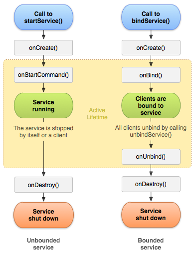

### Using the Service class

```java

public class ExampleFragment extends Fragment {
    //...
    private ExampleService exampleService;
    private boolean isExampleServiceBounded = false;
    private final ServiceConnection exampleServiceConnection = new ServiceConnection() {
        @Override
        public void onServiceConnected(ComponentName name, IBinder service) {
            ExampleService.ExampleBinder binder = (ExampleService.ExampleBinder) service;
            exampleService = binder.getService();
            isExampleServiceBounded = true;
        }

        @Override
        public void onServiceDisconnected(ComponentName name) {
            isExampleServiceBounded = false;
        }
    };

    public void startExampleService() {
        Intent intent = new Intent(getContext(), ExampleService.class);
        requireActivity().startService(intent);
        requireActivity().bindService(intent, exampleServiceConnection, 0);
    }

    private void stopExampleService() {
        Intent intent = new Intent(getContext(), ExampleService.class);
        requireActivity().stopService(intent);
    }

    private void bindExampleService() {
        if (ExampleService.isAlive()) {
            Intent intent = new Intent(getContext(), ExampleService.class);
            requireActivity().bindService(intent, exampleServiceConnection, 0);
        }
    }

    private void unbindExampleService() {
        if (isExampleServiceBounded) {
            requireActivity().unbindService(exampleServiceConnection);
            isExampleServiceBounded = false;
        }
    }
    //...
}

public class ExampleService extends Service {

    private static ExampleService INSTANCE = null;
    private final IBinder binder = new ExampleBinder();

    @Override
    public void onCreate() {
        // If the service is already running, this method is not called.
        super.onCreate();
        INSTANCE = this;
    }

    @Override
    public int onStartCommand(Intent intent, int flags, int startId) {
        // The system invokes this method by calling startService().
        // This method can be not implement if you only want to provide binding.
        // If you implement this, it need to stop by calling stopSelf() or stopService().
        //return START_STICKY;
        //return START_NOT_STICKY;
        //return START_REDELIVER_INTENT;
        return super.onStartCommand(intent, flags, startId);
    }

    @Override
    public void onDestroy() {
        // This is the last call that the service receives.
        super.onDestroy();
        INSTANCE = null;
    }

    @Nullable
    @Override
    public IBinder onBind(Intent intent) {
        // The system invokes this method by calling bindService().
        // You must always implement this method.
        //return null;
        return binder;
    }

    public static boolean isAlive() {
        try {
            return INSTANCE != null && INSTANCE.ping();
        } catch (NullPointerException e) {
            return false;
        }
    }

    /**
     * Simply returns `true`.
     * If the service is still active, this method will be accessible.
     */
    private boolean ping() {
        return true;
    }

    public class ExampleBinder extends Binder {

        public ExampleService getService() {
            return ExampleService.this;
        }
    }
}
```

#### The return value from `onStartCommand()` must be one of the following constants:

- **START_NOT_STICKY** — do not recreate the service.
- **START_STICKY** — recreate the service and call `onStartCommand()`, but do not redeliver the last intent (`null`
  intent).
- **START_REDELIVER_INTENT** — recreate the service and call `onStartCommand()` with the last intent that was delivered
  to the service.

If a component starts the service by calling `startService()` (which results in a call to `onStartCommand()`), the
service continues to run until it stops itself with `stopSelf()` or another component stops it by
calling `stopService()`.

If a component calls `bindService()` to create the service and **`onStartCommand()` is not called**, the service runs
only as long as the component **is bound to it**. After the service is unbound from all of its clients, the system
destroys it.

If the service **doesn't also provide binding**, the `Intent` that is delivered with `startService()` is the only mode
of communication between the application component and the service. However, if you want the service to send a result
back, the client that starts the service can create a `PendingIntent` for a broadcast (with `getBroadcast()`) and
deliver it to the service in the `Intent` that starts the service. The service can then use the broadcast to deliver a
result.

Multiple requests to start the service result in multiple corresponding calls to the service's `onStartCommand()`.

The Android system stops a service only when memory is low and it must recover system resources for the activity that
has user focus. If the service is bound to an activity that has user focus, it's less likely to be killed; if the
service is declared to run in the foreground, it's rarely killed. If the service is started and is long-running, the
system lowers its position in the list of background tasks over time, and the service becomes highly susceptible to
killing.

If your app targets API level 26 or higher, the system imposes restrictions. To create a foreground service, the app
should call `startForegroundService()`. That method creates a background service, but the method signals to the system
that the service will promote itself to the foreground. Once the service has been created, the service must call
its `startForeground()` method **within 5 seconds**.

### ///// References (online):

- [Android developers: Services overview](https://developer.android.com/guide/components/services)
- [Android developers: Service](https://developer.android.com/reference/android/app/Service)
- [Android developers: Bound services overview](https://developer.android.com/guide/components/bound-services)

[^ up](#knowledge-notes)

---

## Broadcast Receiver

### ///// References (online):

- [Android developers: Broadcasts overview](https://developer.android.com/guide/components/broadcasts)
- [Android Broadcast Receiver](https://medium.com/@huseyinozkoc/android-broadcast-receiver-tutorial-with-example-230bea21e78)

[^ up](#knowledge-notes)

---

# Fragments

A `Fragment` represents a reusable portion of your app's UI. A `fragment` defines and manages its own layout, has its
own lifecycle, and can handle its own input events. `Fragments` cannot live on their own--they must be hosted by an
`activity` or another `fragment`. The fragment’s view hierarchy becomes part of, or attaches to, the host’s view
hierarchy.

`Activities` are an ideal place to put global elements around your app's user interface, such as a navigation drawer.
Conversely, `fragments` are better suited to define and manage the UI of a single screen or portion of a screen.

The `activity` is then responsible for displaying the correct navigation UI while the `fragment` displays the list with
the proper layout.

You can use multiple instances of the same `fragment` class within the same `activity`, in multiple `activities`, or
even as a child of another `fragment`. With this in mind, you should only provide a `fragment` with the logic necessary
to manage its own UI. **You should avoid depending on or manipulating one `fragment` from another**.

### Create fragment

To create a `fragment`, extend the **AndroidX** `Fragment` class, and override its methods to insert your app logic,
similar to the way you would create an `Activity` class.

```java
class ExampleFragment extends Fragment {
    public ExampleFragment() {
        super(R.layout.example_fragment);
    }
}
```

### Add a fragment to an activity

Generally, your `fragment` must be embedded within an AndroidX `FragmentActivity` or `AppCompatActivity` to contribute a
portion of UI to that activity's layout.

It is strongly recommended to **always use** a `FragmentContainerView` as the container for fragments, as
`FragmentContainerView` includes fixes specific to fragments that other view groups such as `FrameLayout` do not
provide.

- ### Add a fragment via XML

  To declaratively add a fragment to your activity layout's XML, use a `FragmentContainerView` element.

    ```xml
    <!-- res/layout/example_activity.xml -->
    <androidx.fragment.app.FragmentContainerView
        xmlns:android="http://schemas.android.com/apk/res/android"
        android:id="@+id/fragment_container_view"
        android:layout_width="match_parent"
        android:layout_height="match_parent"
        android:name="com.example.ExampleFragment" />
    ```
  The `android:name` attribute specifies the class name of the `Fragment` to instantiate. You can use the `class`
  attribute instead of `android:name` as an alternative way to specify which `Fragment` to instantiate.

- ### Add a fragment programmatically

  To programmatically add a fragment to your activity's layout, the layout should include a `FragmentContainerView` to
  serve as a fragment container.

    ```xml
    <!-- res/layout/example_activity.xml -->
    <androidx.fragment.app.FragmentContainerView
        xmlns:android="http://schemas.android.com/apk/res/android"
        android:id="@+id/fragment_container_view"
        android:layout_width="match_parent"
        android:layout_height="match_parent" />
    ```
  The `android:name` attribute isn't used on the `FragmentContainerView` here, so no specific fragment is automatically
  instantiated. Instead, a `FragmentTransaction` is used to instantiate a fragment and add it to the activity's layout.

  In your `FragmentActivity` or `AppCompatActivity`, you can get an instance of the `FragmentManager`, which can be used
  to create a `FragmentTransaction`.

    ```java
    public class ExampleActivity extends AppCompatActivity {
        public ExampleActivity() {
            super(R.layout.example_activity);
        }
    
        @Override
        protected void onCreate(Bundle savedInstanceState) {
            super.onCreate(savedInstanceState);
            if (savedInstanceState == null) { // `null` - to ensure that the fragment is added only once
  
                Bundle bundle = new Bundle();
                bundle.putInt("some_int", 0);
  
                getSupportFragmentManager().beginTransaction()
                        .setReorderingAllowed(true)
                        //.add(R.id.fragment_container_view, ExampleFragment.class, null)
                        .add(R.id.fragment_container_view, ExampleFragment.class, bundle) // provide `Bundle` if your fragment requires some initial data
                        .commit();
            }
        }
    }
    ```
  ```java
    class ExampleFragment extends Fragment {
          public ExampleFragment() {
            super(R.layout.example_fragment);
          }
  
          @Override
          public void onViewCreated(@NonNull View view, Bundle savedInstanceState) {
            int someInt = requireArguments().getInt("some_int");
            // ...
          }
    }
    ```

## ///// References (online):

- [Android developers: Fragments](https://developer.android.com/guide/fragments)
- [Android developers: Create a fragment](https://developer.android.com/guide/fragments/create)

***

# Multithreading

When a user opens an application, Android creates its own Linux process. Besides this, the system creates a thread of
execution for that application called the **main thread** or **UI thread**.

**The main thread** is nothing but a handler thread. The main thread is responsible for handling events from all over
the app like callbacks associated with the lifecycle information or callbacks from input events or handling events from
other apps, etc


## Thread

The Java virtual machine allows an application to have multiple threads of execution running concurrently.

Concurrency means running multiple tasks in parallel, it is one of the main reasons that we use threads. As Android is a
single-threaded model, we need to create different threads to perform our task.

```java
  class LooperThread extends Thread {
    public Handler mHandler;

    public void run() {
        // Initialize the current thread as a looper. 
        Looper.prepare();

        // Looper.myLooper(() － Return the Looper object associated with the current thread.
        mHandler = new Handler(Looper.myLooper()) {
            public void handleMessage(Message msg) {
                // process incoming messages here
            }
        };
        // Run the message queue in this thread.
        // Be sure to call quit() or quitSafely() to end the loop.
        Looper.loop();
    }
}
```

We can perform any kind of operation inside threads except updating the UI elements. To update a UI element from a
thread, we need to use either the `Handler` or the `runOnUIThread()` method.

## Looper

The looper is responsible for keeping the thread alive. It is a kind of worker that serves a `MessageQueue` for the
current thread. `Looper` loops through a message queue and sends messages to corresponding threads to process. **There
will be only one unique looper per thread**. So, the looper is providing the thread with the facility to run in a loop
with its own `MessageQueue`.

`Looper.quit()` will immediately terminate the Looper and discard all the messages inside the `MessageQueue`. To make
sure that all message in the `MessageQueue` will be dispatched before quitting, we can use `Looper.quiteSafely()`.

## Handler

As there is only one thread that updates the UI, which is main thread, we use different other threads to do multiple
tasks in the background but finally, to update the UI, we need to post the result to the main or UI thread. So, Android
has provided handlers to make the inter-process communication easier. A handler allows you to send and process `Message`
and `Runnable` objects associated with a thread's `MessageQueue`. Each handler instance i**s associated with a single
thread and that thread’s message queue**.

When a handler is created, it can get a `Looper` object in the constructor, which indicates which thread the handler is
attached to. If you want to use a handler attached to the main thread, you need to use the looper associated with the
main thread by calling `Looper.getMainLooper()`.

### How to schedule:

- `post(Runnable)`, `postAtTime(Runnable, long)`, `postDelayed(Runnable, long)` — The post versions allow you to enqueue
  `Runnable` objects to be called by the message queue when they are received.

- `sendEmptyMessage(int)`, `sendMessage(Message)`, `sendMessageAtTime(Message, long)`
  , `sendMessageDelayed(Message, long)` — The sendMessage versions allow you to enqueue a Message object containing a
  bundle of data that will be processed by the handler’s handleMessage(Message)

## HandlerThread

HandlerThread has their own `Looper` and `MessageQueue` or simply queue, other than the `Thread`. The looper can then be
used to create handler classes. Note that `start()` must still be called.

```java
public class HandlerThreadExample {

    public void doWork() {
        //create the HandlerThread
        HandlerThread handlerThread = new HandlerThread("HandlerThreadName");
        handlerThread.start();

        //create the Handler
        Handler handler = new Handler(handlerThread.getLooper());

        //Use the Handler to send message or post runnables as you deem fit and 
        //all these works will be done in the background.
        handler.post(new Runnable() {
                         // do background work
                     }
        );

        //close the handler thread when done. 
        //I mostly close it in the onDestroy method in activity or fragment.
        handlerThread.quit();
    }
}
```

## MessageQueue

The `MessageQueue` is a queue that has a list of tasks (messages, runnables) that will be executed in a certain thread.
Android maintains a `MessageQueue` on the main thread. It is a low-level class holding the list of messages to be
dispatched by a `Looper`. Messages are not added directly to a `MessageQueue`, but rather through handler objects
associated with the `Looper`. **There will be only one MessageQueue per thread**. The order in the Message list is base
on the timestamp. The message which has the lowest timestamp will be dispatched first.

## Message

The message defines a message containing a description and arbitrary data object that can be sent to a `Handler`. We can
simply say that message is something like a bundle that is used for the transfer of data. While the constructor of
message is public, the best way to get one of these is to call `Message.obtain()` or one of
the `Handler.obtainMessage()`
methods, which will pull them from a pool of recycled objects.

There are different arguments that can be useful:

- `public int what` — User-defined message code so that the recipient can identify what this message is about. **Each
  handler has its own name-space for message codes**, so you do not need to worry about yours conflicting with other
  handlers.
- `public int arg1`, `public int arg2` — `arg1` and `arg2` are lower-cost alternatives to using `setData()` if you only
  need to store a few integer values.
- `public Object obj` — An arbitrary object to send to the recipient. When using Messenger to send the message across
  processes.

For other data transfers, use `Message.setData(Bundle data)`.

## ///// References (online):

* [Multi-Threaded Android: Handler, Thread, Looper, and Message Queue](https://betterprogramming.pub/a-detailed-story-about-handler-thread-looper-message-queue-ac2cd9be0d78)
* [How Looper, MessageQueue, Handler work in Android](https://pivinci.medium.com/how-looper-messagequeue-handler-runnable-work-in-android-dbbe9db62094)
* [Looper, Handler, Thread & HandlerThread](https://medium.com/@kushaalsingla/looper-handler-thread-handlerthread-6dcbd999d192)
* [Android Handler Internals](https://medium.com/@jagsaund/android-handler-internals-b5d49eba6977)
* [MessageQueue and Looper in Android](https://medium.com/@ankit.sinhal/messagequeue-and-looper-in-android-3a18c7fc9181)
* [Handler in Android](https://medium.com/@ankit.sinhal/handler-in-android-d138c1f4980e)
* [Understanding of AsyncTask in Android](https://medium.com/@ankit.sinhal/understanding-of-asynctask-in-android-8fe61a96a238)
* [Main Loop (Главный цикл) в Android Часть 1. Пишем свой цикл](https://habr.com/ru/company/cian/blog/588314/)
* [Main Loop (Главный цикл) в Android Часть 2. Android SDK](https://habr.com/ru/company/cian/blog/589827/)

[^ up](#knowledge-notes)

---

# Views (widgets)

## View Class

`View` class represents the basic building block for user interface components. A `View` occupies a rectangular area on
the screen and is responsible for drawing and event handling. The view is the base class for `widgets`, which are used
to create interactive UI components (buttons, text fields, etc.). The `ViewGroup` subclass is the base class for
layouts, which are invisible containers that hold other `Views` (or other `ViewGroups`) and define their layout
properties.

```java
public class
View extends Object implements Drawable.Callback, KeyEvent.Callback, AccessibilityEventSource {
    // ...
}
```

### View Hierarchy

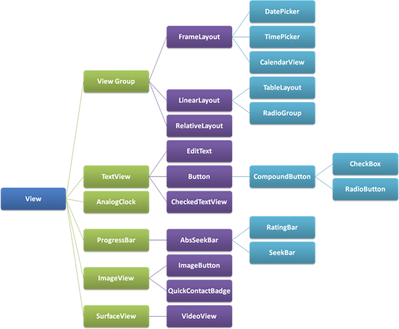

### Write the XML

```html
<?xml version="1.0" encoding="utf-8"?>
<ViewGroup
        xmlns:android="http://schemas.android.com/apk/res/android"
        android:id="@[+][package:]id/resource_name"
        android:layout_height='["dimension" | "match_parent" | "wrap_content"]'
        android:layout_width='["dimension" | "match_parent" | "wrap_content"]'
<!--    [ViewGroup-specific attributes] >-->
<View
        android:id="@[+][package:]id/resource_name"
        android:layout_height='["dimension" | "match_parent" | "wrap_content"]'
        android:layout_width='["dimension" | "match_parent" | "wrap_content"]'
<!--    [View-specific attributes] >-->
<requestFocus/>
</View>
<ViewGroup>
    <View/>
</ViewGroup>
<include layout="@layout/layout_resource"/>
</ViewGroup>
```

### View Life Cycle

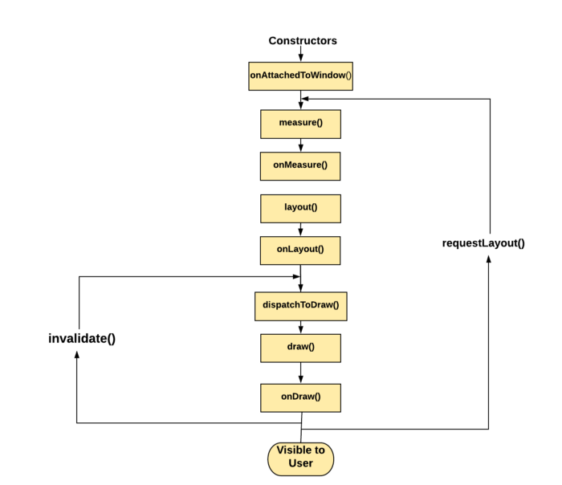

### Attachment / Detachment

- ### `onAttachedToWindow()`

  Called when the view is attached to a window. This is the phase where the view knows it can be active and has a
  surface for drawing. So we can start allocating any resources or set up listeners.

  Note that this function is guaranteed to be called before `onDraw(android.graphics.Canvas)`.

- ### `onDetachedFromWindow()`

  This is called when the view is detached from a window. At this point, it no longer has a surface for drawing. This
  method is called when we call remove view on the `ViewGroup` or when the `Activity` is destroyed etc…

### Traversals

- ### `onMeasure()`

  This is called to find out how big a view should be. In the case of ViewGroup, it will go ahead and call measure on
  each of their child views and the results can help to decide its own size. `onMeasure()` doesn't return a value
  instead we call `setMeasuredDimension()` to set width and height explicitly.

    ```java
    public class
    View implements Drawable.Callback, KeyEvent.Callback, AccessibilityEventSource {
        // ...
        protected void
        onMeasure(int widthMeasureSpec, int heightMeasureSpec) {
            setMeasuredDimension(
                getDefaultSize(getSuggestedMinimumWidth(), widthMeasureSpec),
                getDefaultSize(getSuggestedMinimumHeight(), heightMeasureSpec)
            );
        }
        // ...
    }
    ```

  ### `public static class MeasureSpec`

  A `View.MeasureSpec` encapsulates the layout requirements passed from parent to child. Each `MeasureSpec` represents a
  requirement for either the width or the height. A `View.MeasureSpec` is comprised of a size and a mode. There are
  three possible modes:

    - **MeasureSpec.EXACTLY** — This is used by the parent to impose an exact size on the child. The child must use this
      size, and guarantee that all of its descendants will fit within this size.
    - **MeasureSpec.AT_MOST** — This is used by the parent to impose a maximum size on the child. The child must
      guarantee that it and all of its descendants will fit within this size.
    - **MeasureSpec.UNSPECIFIED** — The parent has not imposed any constraint on the child. It can be whatever size it
      wants. For example, a `LinearLayout` may call `measure()` on its child with the height set to UNSPECIFIED and a
      width of EXACTLY 240 to find out how tall the child view wants to be given a width of 240 pixels.

- ### `onLayout()`

  This is called after measuring the views to position them on the screen. Called from layout when this view should
  assign a size and position to each of its children. Derived classes with children should override this method and call
  layout on each of their children.

    ```java
    public class
    View implements Drawable.Callback, KeyEvent.Callback, AccessibilityEventSource {
        // ...
        protected void
        onLayout(boolean changed, int left, int top, int right, int bottom) {
        }
        // ...
    }
    ```

- ### `onDraw()`

  Sizes and positions are calculated in previous steps, so the view can draw itself based on them.
  In `onDraw(Canvas canvas)` `Canvas` object generated (or updates) has a list of OpenGL-ES commands (displayList) to
  send to the GPU. **Never create objects** in `onDraw()` as it gets called a number of times.

  This is called after measuring the views to position them on the screen.

    ```java
    public class
    View implements Drawable.Callback, KeyEvent.Callback, AccessibilityEventSource {
        // ...
        protected void onDraw(Canvas canvas) {
        }
        // ...
    }
    ```
- ### `View.Invalidate()`

  The `invalidate()` is a method that insists on force reDrawing of a particular view that we wish to show changes.
  Simply we can say `invalidate()` needs to be called when there was a change in view’s appearance. Then it
  invokes `onDraw()`.

- ### `View.requestLayout()`

  At some point, there is a state change in the view. `requestLayout()` is the signal to the view system that it needs
  to recalculate the `Measure` and `Layout` phase of the views (measure → layout → draw). Simply we can
  say `requestLayout()` needs to be called when there was a change in view’s bounds. Then it invokes `onMeasure()`
  , `onLayout()`, `onDraw()`.

### Layout

Layout is a two pass process: a **measure pass** and a **layout pass**. The measuring pass is implemented
in `measure(int, int)` and is a top-down traversal of the view tree. Each view pushes dimension specifications down the
tree during the recursion. At the end of the measure pass, every view has stored its measurements. The second pass
happens in `layout(int, int, int, int)` and is also top-down. During this pass each parent is responsible for
positioning all of its children using the sizes computed in the measure pass.

A parent view may call `measure()` more than once on its children. For example, the parent may measure each child once
with unspecified dimensions to find out how big they want to be, then call `measure()` on them again with actual numbers
if the sum of all the children's unconstrained sizes is too big or too small.

### Custom Attributes

First thing to do to add a custom attribute is to declare a styleable in XML-file. You can either add your own
attribute (remember to prefix it) or reuse an existing one. Reusing attributes is just as easy — just remember to use
the same namespace, name and type as the original declaration.

In a typical case, you need only two constructors and a bit of initialization code. `obtainStyledAttributes()` is used
to get an array of values for this view considering default style, the current theme and XML attributes. Then, attribute
by attribute, you have to get a value by id and set it to the `View`. Notice how the attribute names declared in XML (
with namespaces) are transformed to field names of the ids in the example.

```xml
<?xml version="1.0" encoding="utf-8"?>
<resources>
    <declare-styleable name="GenericView">
        <attr name="isMaskedOverlay" format="boolean"/>
        <attr name="isHugeSize" format="boolean"/>
        <attr name="isContactlessIconVisible" format="boolean"/>
    </declare-styleable>
</resources>
```

```kotlin
class GenericView : Image(context, attrs, defStyle) {
    init {
        context.withStyledAttributes(attrs, R.styleable.GenericView) {
            if (getBoolean(R.styleable.GenericView_isMaskedOverlay, false)) {
                setMaskedOverlay()
            }
        }
    }
}
```

```java
public class ImageView extends ImageView {
    // ...
    private void initImageView(AttributeSet attrs, int defStyleAttr, int defStyleRes) {
        TypedArray a = getContext().getTheme().obtainStyledAttributes(attrs, R.styleable.GenericView, defStyleAttr, defStyleRes);
        Boolean isMaskedOverlay = (a.getBoolean(R.styleable.GenericView_isMaskedOverlay, false));
        if (isMaskedOverlay) {
            setMaskedOverlay();
        }
        a.recycle(); // TypedArray objects are a shared resource and must be recycled after use.
    }
}
```

```xml
<?xml version="1.0" encoding="utf-8"?>
<LinearLayout
        xmlns:android="http://schemas.android.com/apk/res/android"
        xmlns:whatever="http://schemas.android.com/apk/res-auto"
        android:orientation="vertical"
        android:layout_width="fill_parent"
        android:layout_height="fill_parent">

    <org.example.mypackage.MyCustomView
            android:layout_width="fill_parent"
            android:layout_height="wrap_content"
            android:gravity="center"
            whatever:isMaskedOverlay="true"/>
</LinearLayout>
```

### ///// References (online):

* [Android developers: View](https://developer.android.com/reference/android/view/View)
* [The Life Cycle of a View in Android](https://proandroiddev.com/the-life-cycle-of-a-view-in-android-6a2c4665b95e)
* [Draw Custom Views in Android](https://betterprogramming.pub/draw-custom-views-in-android-a321fa157d60)
* [Guide to Android custom views: attributes](https://medium.com/@Zielony/guide-to-android-custom-views-attributes-ab28de3e54b7)
* [StackOverflow: Defining custom attrs](https://stackoverflow.com/questions/3441396/defining-custom-attrs)
* [Создание собственной View под Android – может ли что-то пойти не так?](https://habr.com/ru/post/321890/)

[^ up](#knowledge-notes)

***

# Context

## Context Class

Interface to global information about an application environment. This is an abstract class whose implementation is
provided by the Android system. It allows access to application-specific resources and classes, as well as up-calls for
application-level operations such as launching activities, broadcasting and receiving intents, etc.

```java
public abstract class
Context extends Object {
}
```

## ContextWrapper Class

Proxying implementation of Context that simply delegates all of its calls to another Context. Can be subclassed to
modify behavior without changing the original Context.

```java
public class
ContextWrapper extends Context {
}
```

## ContextThemeWrapper Class

A context wrapper that allows you to modify or replace the theme of the wrapped context.

```java
public class
ContextThemeWrapper extends ContextWrapper {
}
```

```java
public class
Activity extends ContextThemeWrapper implements LayoutInflater.Factory2, Window.Callback, KeyEvent.Callback, View.OnCreateContextMenuListener, ComponentCallbacks2 {
}
```

## ///// References (online):

- [Android developers: Context](https://developer.android.com/reference/android/content/Context)
- [Android developers: ContextWrapper](https://developer.android.com/reference/android/content/ContextWrapper)
- [Android developers: ContextThemeWrapper](https://developer.android.com/reference/android/view/ContextThemeWrapper)

[^ up](#knowledge-notes)

---

# ProGuard

И крутая опция в proguard-rules.pro:
-whyareyoukeeping class com.github.kolya.myapplication.objects.PaymentData В результате билда в консоль пишет :

```
Task :app:minifyReleaseWithR8
com.github.kolya.myapplication.objects.PaymentData
|- is referenced in keep rule:
|  /home/nick/TempProjects/MyApplication3/app/proguard-rules.pro:22:1
```

Типо находит строку правила почему оставило и не обфусцировало определенный класс

## ///// References (online):

- [Reading ProGuard’s Outputs](https://jebware.com/blog/?p=484)
- [ProGuard Playground](https://playground.proguard.com)

***

# Frameworks

# Moxy

## View

## `interface View implements MvpView`

```kotlin
interface NewsArticlesView : MvpView {

    @OneExecution
    fun setToolbarTitle(title: String?)

    @AddToEndSingle
    fun switchProgressLoading(show: Boolean)

    @AddToEndSingle
    fun showErrorDialog()

    @AddToEndSingle
    fun setNewsArticleList(newsArticles: List<NewsArticle>)
}
```

## ViewState

## `MvpViewState<View extends MvpView>`

- Method `protected abstract void restoreState(View view)` - is calling for new `View` and for restored `View`.

- `MvpViewState` holds list of `WeakReferences` to `Views`

## Presenter

## `MvpPresenter<View extends MvpView>`

- Method `public View getViewState()` returns an instance of the `ViewState`

- For attaching/detaching `View` to/from `Presenter` use `public void attachView(View view)`
  and `public void detachView(View view)`

- `Presenter` can hold list of `Views`

- Important method `protected void onFirstViewAttach()` - is using for the first time attaching `View`
  to `Presenter`

- Method `public boolean isInRestoreState(View view)` - to understand which state `View` has.

## MvpFacade

It is singleton.

Method `public static void init()` is need to call in `onCreate()` method of `Application `class.

## MvpApplication

You may want to extend your `Application` class from `MvpApplication`.

## Model

You can choose any implementation of Model layer.

## StateStrategy

- `AddToEndStrategy` – add new command to the end of the queue. The Default strategy.
- `AddToEndSingleStrategy` – delete old command (if it exists) and add new command to the end of the queue.
- `SingleStateStrategy` – clear the queue and then add command to the end of the queue.
- `SkipStrategy` – don't add the command to the queue but make an effect on the view state if it is existing.
- `OneExecuteStrategy` — add command to the queue only to make an effect on the view and then the command will be
  deleted from the queue.

## MvpDelegate

```kotlin
private val myPresenter: MyPresenter by moxyPresenter {
    MyComponent.get().myPresenter
}
```

## Annotations

- `@InjectPresenter` – for managing the lifecycle of the `Presenter`.
- `@InjectViewState` – for linking the `ViewState` to `Presenter`.
- `@StateStrategyType` – for managing the add and release command strategy from queue of the commands in `ViewState`.
- `@GenerateViewState` – for generating a bytecode of the `ViewState` of the `View` interface.

## ///// References (online):

- [Moxy](https://github.com/Arello-Mobile/Moxy)
- [Moxy — реализация MVP под Android с щепоткой магии](https://habr.com/ru/post/276189/)
- [Стратегии в Moxy (часть 1)](https://habr.com/ru/company/redmadrobot/blog/325816/)
- [Стратегии в Moxy (Часть 2)](https://habr.com/ru/company/redmadrobot/blog/341108/)
- [MVP на стероидах: заставляем робота писать код за вас](https://habr.com/ru/company/redmadrobot/blog/305798/)
- [MVP для Android — преимущества использования Moxy в качестве вспомогательной библиотеки](https://habr.com/ru/post/506806/)

[^ up](#knowledge-notes)

---

# DI Approach Comparison

## Dagger

### Dagger’s benefits:

- The “official” framework by Google
- Most popular
- Biggest feature set
- Compile-time validation

### Dagger’s drawbacks:

- Build time overhead
- Complex
- Poor official documentation

## Hilt

### Hilt’s benefits:

- Provides better default “template” compared to Dagger
- Less space for mistakes compared to Dagger
- Decent documentation

### Hilt’s drawbacks:

- Risk of additional build time overhead

## Koin

### Koin’s benefits:

- Simple
- Almost no build time overhead
- Good documentation
- Good support

### Koin’s drawbacks:

- No compile-time validation (i.e. runtime errors)
- Limited feature set compared to Dagger and Hilt (e.g. as for today, no ability to add binding for Activity object)
- Risk of user-facing performance issues if runtime reflection is used (optional)
- Can’t be used in Java projects

## Pure DI

### Pure DI’s benefits:

- No performance concerns
- Simple to understand and modify

### Pure DI’s drawbacks:

- Initial implementation requires special knowledge and skills
- More manually written code than when using DI frameworks
- Not “sexy” enough for many developers

## ///// References (online):

- [Dagger vs Hilt vs Koin vs Pure Dependency Injection](https://www.techyourchance.com/dagger-vs-hilt-vs-koin-vs-pure-dependency-injection)

---

# Dagger

...

## ///// References (online):

- [Dagger](https://dagger.dev/)
- [Using Dagger in Android apps](https://developer.android.com/training/dependency-injection/dagger-android)
- [Dagger basics](https://developer.android.com/training/dependency-injection/dagger-basics)
- [Dagger 2. Часть первая. Основы, создание графа зависимостей, Scopes](https://habr.com/ru/post/279125/)
- [Dagger 2. Часть вторая. Custom scopes, Component dependencies, Subcomponents](https://habr.com/ru/post/279641/)
- [Dagger 2. Часть третья. Новые грани возможного](https://habr.com/ru/post/320676/)
- [Дружественное введение в Dagger 2. Часть 1](https://habr.com/ru/post/307434/)
- [Дружественное введение в Dagger 2. Часть 2](https://habr.com/ru/post/308040/)
- [Dagger 2 – это элементарно (Часть 1)](https://habr.com/ru/post/466725/)
- [Dagger 2 – это элементарно (Часть 2)](https://habr.com/ru/post/466769/)

[^ up](#knowledge-notes)

***

# Algorithms

# Binary Search

Binary search is a textbook algorithm based on the idea to compare the target value to the middle element of the array.

If the target value is equal to the middle element - we're done.

If the target value is smaller - continue to search on the left.

If the target value is larger - continue to search on the right.

> Task Constraints:
>
> 1 <= `nums.length` <= 10^4
>
> -10^4 < `nums[i]`, `target` < 10^4
>
> All the integers in `nums` are unique.
>
> `nums` is sorted in ascending order.

```java
public class MySolution {

    private final int notFoundResult = -1;
    private int[] nums;
    private int target;
    private int minIndex;
    private int maxIndex;

    public int search(int[] nums, int target) {
        if (nums.length == 0) {
            return notFoundResult;
        } else {
            initializeSearchVariables(nums, target);
            return binarySearch();
        }
    }

    private void initializeSearchVariables(int[] nums, int target) {
        this.nums = nums;
        this.target = target;
        minIndex = 0;
        maxIndex = nums.length - 1;
    }

    private int binarySearch() {
        int mediumIndex = minIndex + (maxIndex - minIndex) / 2; // (minIndex + maxIndex) - can make `Int` overflow!!!
        int mediumValue = nums[mediumIndex];
        if (mediumValue == target) {
            return mediumIndex;
        } else if (shouldDoBinarySearch()) {
            setMinMaxIndexes(mediumIndex, isAscendingSearch(mediumValue, target));
            return binarySearch();
        } else if (target == nums[minIndex]) {
            return minIndex;
        } else if (target == nums[maxIndex]) {
            return maxIndex;
        } else {
            return notFoundResult;
        }
    }

    private boolean isAscendingSearch(int mediumValue, int target) {
        return mediumValue < target;
    }

    private void setMinMaxIndexes(int mediumIndex, boolean isAscending) {
        if (isAscending) {
            minIndex = mediumIndex;
        } else {
            maxIndex = mediumIndex;
        }
    }

    private boolean shouldDoBinarySearch() {
        return (maxIndex - minIndex) > 1;
    }
}
```

```java
public class SolutionFromInternet {
    public int search(int[] nums, int target) {
        int pivot, left = 0, right = nums.length - 1;
        while (left <= right) {
            pivot = left + (right - left) / 2;
            if (nums[pivot] == target) return pivot;
            if (target < nums[pivot]) right = pivot - 1;
            else left = pivot + 1;
        }
        return -1;
    }
}
```

## ///// References (online):

* [Binary Search](https://leetcode.com/explore/learn/card/binary-search/)

[^ up](#knowledge-notes)

***