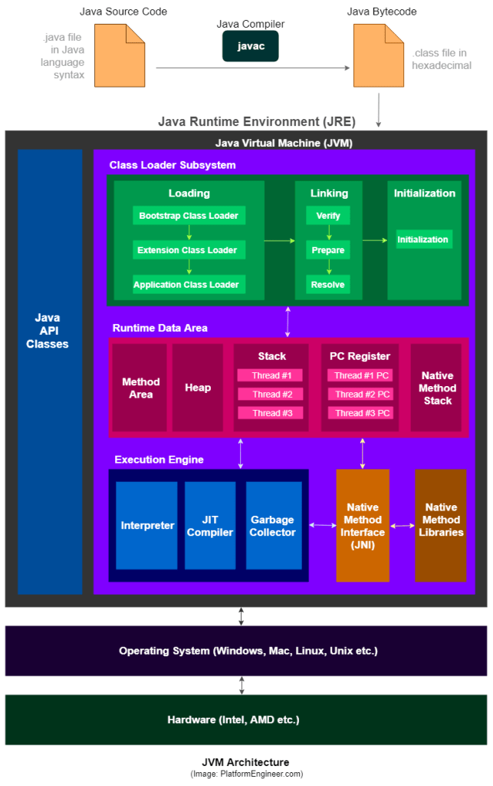

# Knowledge Notes

- [Git](#git)
    - [Git Initial](#git-initial)
- [Java](#java)
    - [Basics](#basics)
        - [String pool](#string-pool)
    - Collections
    - [Concurrency](#concurrency)
        - [Thread](#java-thread)
        - [Lock vs Monitor](#lock-vs-monitor)
        - [Synchronized vs Volatile vs Atomic](#synchronized-vs-volatile-vs-atomic)
        - Executors
        - Synchronizers
        - Concurrent Collections
    - [JVM](#jvm)
        - [JVM Architecture](#jvm-architecture)
        - [JVM Memory Model](#jvm-memory-model)
            - [Stack vs Heap](#stack-vs-heap)
        - [Garbage Collector](#garbage-collector)
        - [Java Reference Types](#java-reference-types)
- [Android](#android)
    - [Multithreading](#multithreading)
        - Thread
        - Looper
        - Handler
        - Message Queue
        -

***

# Git

# Git Initial

```shell
$ git config --global user.email "user@mail.com"
$ git config --global user.name "User Name"
$ git config --global init.defaultBranch main
$ git init
$ git add .
$ git add .gitignore
$ git commit -m "Initial commit"
$ git remote add origin git@github.com:username/projectname.git
  (or git remote add origin https://github.com/username/projectname.git)
$ git push -u origin main
```

[^ up](#knowledge-notes)

***

# Java

# Basics

## String Pool

String Pool is a place in the Heap memory of Java to store string literal. To decrease the number of String objects
created in the JVM, the String class keeps a pool of strings.

Why strings are immutable:

* Use of String Constant Pool (caching the String literals)
* Security
* Thread-Safety
* Cacheable HashCode
* Improved Performance

String objects are created in two ways:

1. ### Using double quotes(" "):

   `String stringLiteral = “String literal”;`

   The above statement first searches for the string `“String literal”` in the string pool, if found it just gives it a
   reference `stringLiteral` from string pool. If not found it creates a string object and places it in the string pool
   and then gives it a reference `stringLiteral`.

   > In this case, **only one object is created**: in the `string pool`.

2. ### Using the 'new' keyword:

   `String newString = new String("New string");`

   The above statement creates a string object in heap memory, returns a reference from heap memory and checks whether
   it is present in the string pool or not. If the string “New string” is not present in the string pool then it will
   place this string in the string pool (JVM will point to that string object) else it will skip it.

   > _Case 1:_ **Two objects are created**: one in the `heap memory` and the other in the `string pool`.
   >
   > _Case 2:_ **Only one object is created**: in the `heap memory`.

### String.intern()

When the `String.intern()` method is invoked, if the `string pool` already contains a string equal to this String
object (the object with which intern method is being called) , then the string from the `string pool` is returned.
Otherwise, this String object is added to the `string pool`, and a reference to this String object in `string pool` is
returned.

### ///

### References (online):

* [Concept of String Pool And String Object Creation In Java](https://medium.com/nerd-for-tech/concept-of-string-pool-and-string-object-creation-in-java-27ed2b3089f5)
* [String Pool in Java? Number of Objects Created When ‘Literals’ or ‘New’ Used?](https://medium.com/javarevisited/what-does-string-pool-mean-in-java-414c725fbd59)

[^ up](#knowledge-notes)

***

# Concurrency

## Java Thread

In concurrent programming, there are two basic units of execution: processes and threads. A process has a self-contained
execution environment. A process generally has a complete, private set of basic run-time resources; in particular, each
process has its own memory space.

A Thread is a lightweight Process. Both processes and threads provide an execution environment, but creating a new
thread requires fewer resources than creating a new process.

Threads exist within a process — every process has at least one.

### Create new Thread:

1. #### Provide a Runnable object

    ```java
    public class HelloRunnable implements Runnable {
    
        public void run() {
            System.out.println("Hello from a thread!");
        }
    
        public static void main(String[] args) {
            (new Thread(new HelloRunnable())).start();
        }
    
    }
    ```

2. #### Extending the Thread Class.

   The Thread class itself implements Runnable, though its run method does nothing.

    ```java
    public class HelloThread extends Thread {
    
        public void run() {
            System.out.println("Hello from a thread!");
        }
    
        public static void main(String[] args) {
            (new HelloThread()).start();
        }
    
    }
    ```

- #### Implementing the Callable Interface

  To create the thread, a Runnable is required. To obtain the result, a Future is required.

  The Java library has the concrete type FutureTask, which implements Runnable and Future, combining both functionality
  conveniently. A FutureTask can be created by providing its constructor with a Callable. Then the FutureTask object is
  provided to the constructor of Thread to create the Thread object. Thus, **indirectly**, the thread is created with a
  Callable. For further emphasis, note that **there is no way to create the thread directly with a Callable**.

    ```java
    public class CallableExample implements Callable {
    
        public Object call() throws Exception {

            Random generator = new Random();
            Integer randomNumber = generator.nextInt(5);
            Thread.sleep(randomNumber * 1000);
    
            return randomNumber;
        }
    }
  
    public class CallableFutureTest {
  
        public static void main(String[] args) throws Exception {
            
            FutureTask[] randomNumberTasks = new FutureTask[5];
            
            for (int i = 0; i < 5; i++) {
                Callable callable = new CallableExample();
                randomNumberTasks[i] = new FutureTask(callable);
                Thread t = new Thread(randomNumberTasks[i]);
                t.start();
            }
    
            for (int i = 0; i < 5; i++) {
                System.out.println(randomNumberTasks[i].get());
                // As it implements Future, we can call get()
                // This method blocks till the result is obtained
                // The get method can throw checked exceptions
                // like when it is interrupted. This is the reason
                // for adding the throws clause to main
            }
        }
    }
    ```

- #### By using the Executor Framework along with Runnable and Callable Tasks
  Executor provides a way of decoupling task submission from the mechanics of how each task will be run, including
  details of thread use, scheduling, etc. An Executor is normally used instead of explicitly creating threads. The
  command may execute in a new thread, in a pooled thread, or in the calling thread, at the discretion of the Executor
  implementation.

    ```java
    public class HelloExecutor {
    
        public static Executor executor;
    
        public static void main(String[] args) {
            executor.execute(new RunnableTask1());
            executor.execute(new RunnableTask2());
        }
    }  
    ```

### Thread states:


- **New** — When we create an instance of Thread class, a thread is in a new state.
- **Runnable** — The Java thread is in running state.
- **Suspended** — A running thread can be suspended, which temporarily suspends its activity. A suspended thread can
  then be resumed, allowing it to pick up where it left off.
- **Blocked** — A java thread can be blocked when waiting for a resource.
- **Terminated** — A thread can be terminated, which halts its execution immediately at any given time. Once a thread is
  terminated, it cannot be resumed.

### Liveness

A concurrent application's ability to execute in a timely manner is known as its liveness.

- **Deadlock** — describes a situation where two or more threads are blocked forever, waiting for each other.
- **Starvation** — describes a situation where a thread is unable to gain regular access to shared resources and is
  unable to make progress.
- **Livelock** — A thread often acts in response to the action of another thread. If the other thread's action is also a
  response to the action of another thread, then livelock may result. As with deadlock, livelocked threads are unable to
  make further progress. However, the threads are not blocked — they are simply too busy responding to each other to
  resume work.

### Thread Class vs Runnable Interface

* If we extend the Thread class, our class cannot extend any other class because Java doesn't support multiple
  inheritance. But, if we implement the Runnable interface, our class can still extend other base classes.
* We can achieve basic functionality of a thread by extending Thread class because it provides some inbuilt methods like
  `yield()`, `interrupt()` etc. that are not available in Runnable interface.
* Using runnable will give you an object that can be shared amongst multiple threads.

### Callable vs Runnable

* For implementing Runnable, the `run()` method needs to be implemented which does not return anything, while for a
  Callable, the `call()` method needs to be implemented which returns a result on completion. Note that a thread can’t
  be created with a Callable, it can only be created with a Runnable.
* Another difference is that the `call()` method can throw an exception whereas `run()` cannot.

### ///

### References (online):

* [Java Threads - Creating Threads and Multithreading in Java](https://medium.com/edureka/java-thread-bfb08e4eb691)
* [Callable and Future in Java](https://www.geeksforgeeks.org/callable-future-java/)
* [How to Implement Callable Interface in Java](https://www.edureka.co/blog/callable-interface-in-java/)

[^ up](#knowledge-notes)

---

## Lock vs Monitor

### Lock

**A lock is kind of data which is logically part of an object’s header on the heap memory.** Each object in a JVM has
this lock (or mutex) that any program can use to coordinate multi-threaded access to the object. If any thread want to
access instance variables of that object; then thread must “own” the object’s lock (set some flag in lock memory area).
All other threads that attempt to access the object’s variables have to wait until the owning thread releases the
object’s lock (unset the flag).

### Monitor

**Monitor is a synchronization construct that allows threads to have both mutual exclusion (using locks) and
cooperation** i.e. the ability to make threads wait for certain condition to be true (using **wait-set**). In other
words, along with data that implements a lock, every Java object is logically associated with data that implements a
wait-set.

### ///

### References (online):

* [What is a Monitor in Computer Science?](https://www.baeldung.com/cs/monitor)
* [Difference between lock and monitor – Java Concurrency](https://howtodoinjava.com/java/multi-threading/multithreading-difference-between-lock-and-monitor/)
* [Object level lock vs Class level lock in Java](https://howtodoinjava.com/java/multi-threading/object-vs-class-level-locking/)
* [Difference: this vs Myclass.class vs MyClass.getClass() in synchronisation](https://stackoverflow.com/questions/51839363/difference-this-vs-myclass-class-vs-myclass-getclass-in-synchronisation)
* [IllegalMonitorStateException in Java](https://www.baeldung.com/java-illegalmonitorstateexception)

[^ up](#knowledge-notes)

---


## Synchronized vs Volatile vs Atomic

### Synchronized

- Provides **mutual exclusion** - two threads can not run a synchronized method or block at the same time. Though beware
  of using static and non-static synchronized methods together.
- Provides **visibility guaranteed** - updated values of variables modified inside synchronized context will be visible
  to all threads.
- A synchronized keyword also provides **blocking**. A thread will block until the lock is available, before entering to
  code protected by a synchronized keyword. See how synchronization works in Java to know all about synchronized
  keyword.
- As per the **happens-before rule**, an unlock on a monitor happens-before every subsequent lock on the same monitor.

### Volatile

- It provides a **visibility guarantee**. As per the happens-before rule, write to volatile variable happens before
  every subsequent read of the same variable.
- It also prevents Compiler from doing smart things, which can create problems in a multi-threading environment, like
  caching variables, re-ordering of code, etc.

### Atomic classes like AtomicInteger, AtomicLong, and AtomicReference

- Atomic variables also provides the same memory semantics as a volatile variable, but with an added feature of
  making **compound action** atomic.
- It provides a convenient method to perform atomic increment, decrement, **CAS (compare-and-swap) operations**. Useful
  methods are `addAndGet(int delta)`, `compareAndSet(int expect, int update)`, `incrementAndGet()` and
  `decrementAndGet()`

### ///

### References (online):

* [Difference between atomic, volatile and synchronized in Java](https://javarevisited.blogspot.com/2020/04/difference-between-atomic-volatile-and-synchronized-in-java-multi-threading.html#axzz79ky1D7bi)
* [What is the difference between atomic / volatile / synchronized?](https://stackoverflow.com/questions/9749746/what-is-the-difference-between-atomic-volatile-synchronized)

[^ up](#knowledge-notes)

---

## ///

## References (online):

* [Java Tutorial Lesson: Concurrency](https://docs.oracle.com/javase/tutorial/essential/concurrency/)
* [Многопоточность в Java](https://habr.com/ru/post/164487/)
* [Обзор java.util.concurrent.*](https://habr.com/ru/company/luxoft/blog/157273/)
* [Справочник по синхронизаторам java.util.concurrent.*](https://habr.com/ru/post/277669/)

[^ up](#knowledge-notes)

***

# JVM

## JVM Architecture

JVM is only a specification, and its implementation is different from vendor to vendor.



### 1. Class Loader Subsystem

The JVM resides on the RAM. During execution, using the Class Loader subsystem, the class files are brought on to the
RAM. This is called Java’s dynamic class loading functionality. It loads, links, and initializes the class file (.class)
when it refers to a class for the first time at runtime (not compile time).

- #### Loading
  Loading compiled classes (.class files) into memory is the major task of Class Loader. Usually, the class loading
  process starts from loading the main class (i.e. class with static main() method declaration). All the subsequent
  class loading attempts are done according to the class references in the already-running classes

- #### Linking
  Linking involves in verifying and preparing a loaded class or interface, its direct superclasses and superinterfaces,
  and its element type as necessary, while following the below properties.

- #### Initialization
  Here, the initialization logic of each loaded class or interface will be executed (e.g. calling the constructor of a
  class). This is the final phase of class loading where all the static variables are assigned with their original
  values defined in the code and the static block will be executed (if any). This is executed line by line from top to
  bottom in a class and from parent to child in class hierarchy.

### 2. Runtime Data Area

Runtime Data Areas are the memory areas assigned when the JVM program runs on the OS. In addition to reading .class
files, the Class Loader subsystem generates corresponding binary data and save the information (*fully qualified name of
the loaded class, .class file is related to a Class/Interface/Enum Modifiers, static variables, and method etc.*) in the
Method area for each class separately. Then, for every loaded .class file, it creates exactly one object of Class to
represent the file in the Heap memory as defined in java.lang package. This Class object can be used to read class level
information (class name, parent name, methods, variable information, static variables etc.) later in our code.

- ### Method Area

  This is a shared resource (only 1 method area per JVM). Is not thread safe. Method area stores class level data (
  including static variables) such as:

    - **Classloader reference**.
    - **Run time constant pool** — Numeric constants, field references, method references, attributes.
    - **Field data** — Per field: name, type, modifiers, attributes.
    - **Method data** — Per method: name, return type, parameter types (in order), modifiers, attributes.
    - **Method code** — Per method: bytecodes, operand stack size, local variable size, local variable table, exception
      table.

- ### Heap area

  This is a shared resource (only 1 heap area per JVM). Is not thread safe. Information of all objects and their
  corresponding instance variables and arrays are stored in the Heap area. Heap area is a great target for Garbage
  Collection.

- ### Stack Area

  This is not a shared resource and is thread safe. For every JVM thread, when the thread starts, a separate runtime
  stack gets created in order to store method calls. For every such method call, one entry will be created and added
  (pushed) into the top of runtime stack and such entry is called a _Stack Frame_. The size of stack frame is fixed
  according to the method. The frame is removed (popped) when the method returns normally or if an uncaught exception is
  thrown during the method invocation. After a thread terminates, its stack frame will also be destroyed by JVM.  
  A Stack Frame is divided into three sub-entities:

    - **Local Variable Array** — Variable from index 0 is the reference of a class instance where the method belongs.
      From 1, the parameters sent to the method are saved.
    - **Operand Stack** — Each method exchanges data between the Operand stack and the local variable array, and pushes
      or pops other method invoke results.
    - **Frame Data** — All symbols related to the method are stored here.


- ### Program Counter Registers
  For each JVM thread, when the thread starts, a separate PC Register gets created in order to hold the address of
  currently-executing instruction (memory address in the Method area).


- ### Native Method Stack
  There is a direct mapping between a Java thread and a native operating system thread. A separate native stack also
  gets created in order to store native method information (often written in C/C++) invoked through JNI (Java Native
  Interface).

### 3. Execution Engine

The actual execution of the bytecode occurs here. Execution Engine executes the instructions in the bytecode
line-by-line by reading the data assigned to above runtime data areas.

- ### Interpreter
  It interprets the bytecode and executes the instructions one-by-one.


- ### Just-In-Time (JIT) Compiler
  First, it compiles the entire bytecode to native code (machine code). Then for repeated method calls, it directly
  provides the native code. The native code is stored in the cache, thus the compiled code can be executed quicker.


- ### Garbage Collector (GC)
  As long as an object is being referenced, the JVM considers it alive. Once an object is no longer referenced and
  therefore is not reachable by the application code, the garbage collector removes it and reclaims the unused memory.
  We can trigger it by calling System.gc() method (But the execution is not guaranteed.).

### 4. Java Native Interface (JNI)

This interface is used to interact with Native Method Libraries. This enables JVM to call C/C++ libraries and to be
called by C/C++ libraries which may be specific to hardware.

### 5. Native Method Libraries

This is a collection of C/C++ Native Libraries which is required for the Execution Engine and can be accessed through
the provided Native Interface.

### ///

### References (online):

* [The Structure of the Java Virtual Machine](https://docs.oracle.com/javase/specs/jvms/se10/html/jvms-2.html)
* [Understanding JVM Architecture](https://medium.com/platform-engineer/understanding-jvm-architecture-22c0ddf09722)

[^ up](#knowledge-notes)

***

## JVM Memory Model


### 1. Heap Memory

It is a larger region of RAM which is used for dynamic memory allocation. All Java objects are stored in the heap and
the scope of the objects is the whole application. The memory management is managed by us in heap, but the unused
objects are cleared by the Garbage collector automatically.


- ### Young Generation
  This is reserved for containing newly-allocated objects Young Gen includes three parts.

    - **Eden Memory** — Most of the newly-created objects goes Eden space. When Eden space is filled with objects, Minor
      Garbage Collection (a.k.a. **Young Collection**) is performed and all the survivor objects are moved to one of the
      survivor spaces.

    - **Survivor Spaces** — Minor Garbage Collection also checks the survivor objects and move them to the other
      survivor space. So at a time, one of the survivor space is always empty. Objects that are survived after many
      cycles of Garbage Collection, are moved to the Old generation memory space. Usually it’s done by setting a
      threshold for the age of the young generation objects before they become eligible to promote to Old generation.
        - **S0 Survivor Space**
        - **S1 Survivor Space**


- ### Old Generation
  This is reserved for containing long-lived objects that could survive after many rounds of Minor Garbage Collection.
  When Old Gen space is full, Major Garbage Collection (a.k.a. **Old Collection**) is performed (usually takes longer
  time).

### 2. Stack

This store's local variables and the partial results. Each thread has its own runtime stack created when the thread is
created. A new frame is created whenever a method is invoked and all the local variables of that method is stored in
that corresponding frame. This is deleted when the method invocation is completed. This is not a shared resource.

### 3. Meta Space

This is part of the native memory and doesn't have an upper limit by default. This is what used to be **Permanent
Generation (PermGen) Space** in earlier versions of JVM. This space is used by the class loaders to store class
definitions. If this space keeps growing, the OS might move data stored here from RAM to virtual memory which might slow
down the application.

### 4. Code Cache

This is where the Just In Time(JIT) compiler stores compiled code blocks that are often accessed. Generally, JVM has to
interpret byte code to native machine code whereas JIT-compiled code need not be interpreted as it is already in native
format and is cached here.

### 5. Shared Libraries

This is where native code for any shared libraries used are stored. This is loaded only once per process by the OS.

### ///

### References (online):

* [Understanding Java Memory Model](https://medium.com/platform-engineer/understanding-java-memory-model-1d0863f6d973)
* [JVM Memory Model](https://amanagrawal9999.medium.com/jvm-memory-model-70821e84af4b)
* [Java Memory Explained](https://medium.com/nerd-for-tech/java-memory-explained-43de6de157be)
* [Visualizing memory management in JVM](https://medium.com/@deepu105/visualizing-memory-management-in-jvm-java-kotlin-scala-groovy-clojure-4fbcc0929482)

[^ up](#knowledge-notes)

***

## Stack vs Heap


### ///

### References (online):

* [Understanding Java Memory Model](https://medium.com/platform-engineer/understanding-java-memory-model-1d0863f6d973)
* [Стек и куча в Java](https://topjava.ru/blog/stack-and-heap-in-java)

[^ up](#knowledge-notes)

---

## Garbage Collector

Java Garbage Collection (GC) is the process of tracking the live objects while destroying unreferenced objects in the
Heap memory in order to reclaim space for future object allocation. Java Garbage Collector runs as a Daemon Thread (i.e.
a low priority thread that runs in the background to provide services to user threads or perform JVM tasks).

### GC process includes:

* **Mark** — Identifying objects that are currently in use and not in use

* **Normal Deletion** — Removing the unused objects and reclaim the free space

* **Deletion with Compacting** — Moving all the survived objects to one survivor space (to increase the performance of
  allocation of memory to newer objects)

### GC roots:

* Local variables and input parameters of the currently executing methods
* Active Java threads
* Static fields of the loaded classes
* JNI references

### Eligibility cases for GC:

* **Nullifying the reference variable** — When a reference variable of an object are changed to NULL, the object becomes
  unreachable and eligible for GC.

* **Re-assigning the reference variable** — When a reference id of one object is referenced to a reference id of some
  other object, then the previous object will have no reference to it any longer. The object becomes unreachable and
  eligible for GC.

* **Object created inside the method** — When such a method is popped out from the Stack, all its members die and if
  some objects were created inside it, then these objects also become unreachable, thus eligible for GC.

* **Anonymous object** — An object becomes unreachable and eligible for GC when its reference id is not assigned to a
  variable.

* **Objects with only internal references (Island of Isolation)**

### Programmatically Calling GC (no guarantee to run)

* Using **System.gc()** method
* Using **Runtime.getRuntime().gc()** method

### GC Execution Strategies

* ### Serial GC

  Simple mark-sweep-compact approach with young and old gen garbage collections (a.k.a. Minor GC and Major GC). Suitable
  for simple stand-alone client-machine applications running with low memory footprint and less CPU power.

  

* ### Parallel GC

  Parallel version of mark-sweep-compact approach for Minor GC with multiple threads (Major GC still happens with a
  single thread in a serial manner).

  

* ### Concurrent Mark Sweep (CMS) GC

  Garbage collection normally happens with pauses (Major GC takes a long time), which makes it problematic for highly
  responsive applications where we can’t afford long pause times. CMS Collector minimizes the impact of these pauses by
  doing most of the garbage collection work (i.e. Major GC) concurrently within the application threads (Minor GC still
  follows the usual parallel algorithm without any concurrent progress with application threads).

* ### G1 GC

  Garbage First (G1) Collector divides the Heap into multiple equal-sized regions and when GC is invoked, first collects
  the region with lesser live data (young gen and old gen implementations don’t apply here). This collector is a
  parallel, concurrent and incrementally compact low-pause garbage collector which intends to replace the CMS Collector.

  

* ### Shenandoah GC

  Compacting work concurrently within the application threads. Experimental until JDK 15.

* ### Z GC

  All GC processes concurrently within the application threads. Experimental until JDK 15.

### ///

### References (online):

* [Understanding Java Garbage Collection](https://medium.com/platform-engineer/understanding-java-garbage-collection-54fc9230659a)
* [Сборка мусора в Java: что это такое и как работает в JVM](https://medium.com/nuances-of-programming/%D1%81%D0%B1%D0%BE%D1%80%D0%BA%D0%B0-%D0%BC%D1%83%D1%81%D0%BE%D1%80%D0%B0-%D0%B2-java-%D1%87%D1%82%D0%BE-%D1%8D%D1%82%D0%BE-%D1%82%D0%B0%D0%BA%D0%BE%D0%B5-%D0%B8-%D0%BA%D0%B0%D0%BA-%D1%80%D0%B0%D0%B1%D0%BE%D1%82%D0%B0%D0%B5%D1%82-%D0%B2-jvm-25bb2570b44c)
* [Дюк, вынеси мусор! — Часть 1](https://habr.com/ru/post/269621/)
* [Дюк, вынеси мусор! — Часть 2](https://habr.com/ru/post/269707/)
* [Дюк, вынеси мусор! — Часть 3](https://habr.com/ru/post/269863/)

[^ up](#knowledge-notes)

---

## Java Reference Types

* ### Strong reference

  Strong references are the ordinary references in Java. Anytime we create a new object, a strong reference is by
  default created.

* ### Soft Reference

  Soft reference objects, which are cleared at the discretion of the garbage collector in response to memory demand.
  Soft references are most often used to implement memory-sensitive caches. A **softly reachable object** has no strong
  references pointing to it. All soft references to softly-reachable objects **are guaranteed to have been cleared
  before a JVM throws an _OutOfMemoryError_**. Softly reachable objects will remain alive for some time after the last
  time they are referenced. The default value is a one second of lifetime per free megabyte in the heap. This value can
  be adjusted.

* ### Weak Reference

  A weakly referenced object is cleared by the Garbage Collector when it's weakly reachable. Weak reachability means
  that an object has neither strong nor soft references pointing to it. First off, the Garbage Collector clears a weak
  reference, so the referent is no longer accessible. Then the reference is placed in a reference queue (if any
  associated exists) where we can obtain it from. At the same time, formerly weakly-reachable objects are going to be
  finalized. One of the best implementations of weak references is the **WeakHashMap**. Reference queue is optional.

* ### Phantom Reference

  These references are only garbage collected when none of the references namely strong references, soft references or
  weak references is being pointed to the object belonging to phantom references. They are always used **along with
  reference queue** and to keep a track of objects which have been finalized. **We can't get a referent of a phantom
  reference: `phantomReference.get()` returns `null`**. One of the use cases is **to determine when an object was
  removed from the memory** which helps to schedule memory-sensitive tasks. For example, we can wait for a large object
  to be removed before loading another one.

### ///

### References (online):

* [Soft References in Java](https://www.baeldung.com/java-soft-references)
* [Weak References in Java](https://www.baeldung.com/java-weak-reference)
* [Phantom References in Java](https://www.baeldung.com/java-phantom-reference)
* [Weak Soft and Phantom references in Java and why they matter](https://medium.com/@ramtop/weak-soft-and-phantom-references-in-java-and-why-they-matter-c04bfc9dc792)
* [Finally understanding how references work in Android and Java](https://medium.com/google-developer-experts/finally-understanding-how-references-work-in-android-and-java-26a0d9c92f83)
* [An overview of Strong, Weak, Soft and Phantom references in Java](https://prateeknima.medium.com/strong-weak-soft-and-phantom-references-in-java-b4f9068e883e)
* [Особенности PhantomReference](https://javarush.ru/groups/posts/2291-osobennosti-phantomreference)
* [Мягкие ссылки на страже доступной памяти или как экономить память правильно](https://habr.com/ru/post/169883/)

[^ up](#knowledge-notes)

***

# Android

## Multithreading

When a user opens an application, Android creates its own Linux process. Besides this, the system creates a thread of
execution for that application called the **main thread** or **UI thread**.

**The main thread** is nothing but a handler thread. The main thread is responsible for handling events from all over
the app like callbacks associated with the lifecycle information or callbacks from input events or handling events from
other apps, etc


### Thread

The Java virtual machine allows an application to have multiple threads of execution running concurrently.

Concurrency means running multiple tasks in parallel, it is one of the main reasons that we use threads. As Android is a
single-threaded model, we need to create different threads to perform our task.

```java
class LooperThread extends Thread {
    public Handler mHandler;

    public void run() {
        Looper.prepare();

        mHandler = new Handler() {
            public void handleMessage(Message msg) {
                // process incoming messages here
            }
        };

        Looper.loop();
    }
}
```

We can perform any kind of operation inside threads except updating the UI elements. To update a UI element from a
thread, we need to use either the `Handler` or the `runOnUIThread()` method.

### Looper

The looper is responsible for keeping the thread alive. It is a kind of worker that serves a `MessageQueue` for the
current thread. Looper loops through a message queue and sends messages to corresponding threads to process. **There
will be only one unique looper per thread**. So, the looper is providing the thread with the facility to run in a loop
with its own `MessageQueue`.

`Looper.quit()` will immediately terminate the Looper and discard all the messages inside the `MessageQueue`. To make
sure that all message in the `MessageQueue` will be dispatched before quitting, we can use `Looper.quiteSafely()`.

### Handler

As there is only one thread that updates the UI, which is main thread, we use different other threads to do multiple
tasks in the background but finally, to update the UI, we need to post the result to the main or UI thread. So, Android
has provided handlers to make the inter-process communication easier. A handler allows you to send and process `Message`
and `Runnable` objects associated with a thread's `MessageQueue`. Each handler instance i**s associated with a single
thread and that thread’s message queue**.

When a handler is created, it can get a **Looper** object in the constructor, which indicates which thread the handler
is attached to. If you want to use a handler attached to the main thread, you need to use the looper associated with the
main thread by calling **Looper.getMainLooper()**.

#### How to schedule:

- `post(Runnable)`, `postAtTime(Runnable, long)`, `postDelayed(Runnable, long)` — The post versions allow you to enqueue
  Runnable objects to be called by the message queue when they are received.

- `sendEmptyMessage(int)`, `sendMessage(Message)`, `sendMessageAtTime(Message, long)`
  , `sendMessageDelayed(Message, long)` — The sendMessage versions allow you to enqueue a Message object containing a
  bundle of data that will be processed by the handler’s handleMessage(Message)

### HandlerThread

HandlerThread has their own `Looper` and `MessageQueue` or simply queue, other than the `Thread`.

```java
public class HandlerThreadExample {

    public void doWork() {
        //create the HandlerThread
        HandlerThread handlerThread = new HandlerThread("HandlerThreadName");
        handlerThread.start();

        //create the Handler
        Handler handler = new Handler(handlerThread.getLooper());

        //Use the Handler to send message or post runnables as you deem fit and 
        //all these works will be done in the background.
        handler.post(new Runnable() {
                         // do background work
                     }
        );

        //close the handler thread when done. 
        //I mostly close it in the onDestroy method in activity or fragment
        handlerThread.quit();
    }
}
```

### MessageQueue

The MessageQueue is a queue that has a list of tasks (messages, runnables) that will be executed in a certain thread.
Android maintains a MessageQueue on the main thread. It is a low-level class holding the list of messages to be
dispatched by a looper. Messages are not added directly to a MessageQueue, but rather through handler objects associated
with the looper. **There will be only one MessageQueue per thread**. The order in the Message list is base on the
timestamp. The message which has the lowest timestamp will be dispatched first.

### Message

The message defines a message containing a description and arbitrary data object that can be sent to a handler. We can
simply say that message is something like a bundle that is used for the transfer of data. While the constructor of
message is public, the best way to get one of these is to call `Message.obtain()` or one of
the `Handler.obtainMessage()`
methods, which will pull them from a pool of recycled objects.

There are different arguments that can be useful:

- `public int what` — User-defined message code so that the recipient can identify what this message is about. **Each
  handler has its own name-space for message codes**, so you do not need to worry about yours conflicting with other
  handlers.
- `public int arg1`, `public int arg2` — `arg1` and `arg2` are lower-cost alternatives to using `setData()` if you only
  need to store a few integer values.
- `public Object obj` — An arbitrary object to send to the recipient. When using Messenger to send the message across
  processes.

For other data transfers, use `Message.setData(Bundle data)`.

### ///

### References (online):

* [Multi-Threaded Android: Handler, Thread, Looper, and Message Queue](https://betterprogramming.pub/a-detailed-story-about-handler-thread-looper-message-queue-ac2cd9be0d78)
* [How Looper, MessageQueue, Handler work in Android](https://pivinci.medium.com/how-looper-messagequeue-handler-runnable-work-in-android-dbbe9db62094)

[^ up](#knowledge-notes)

***